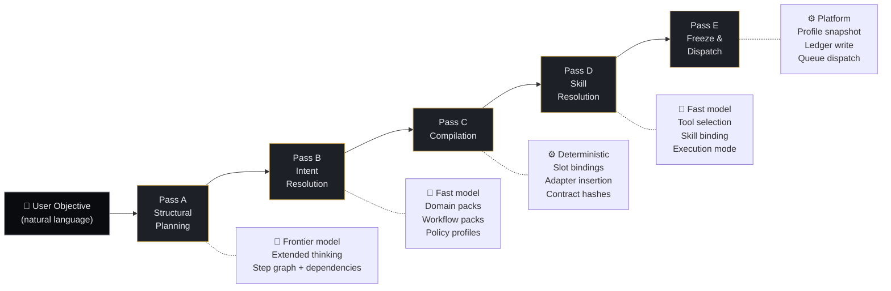
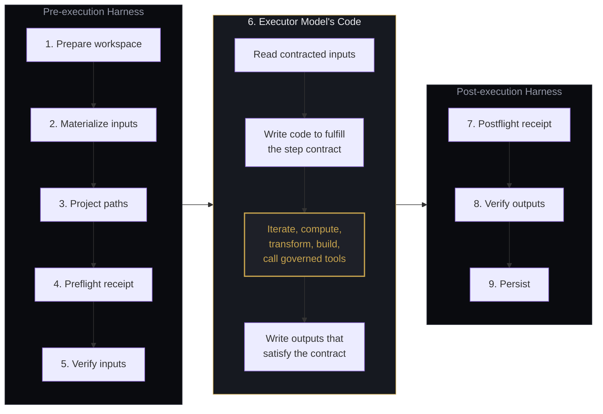
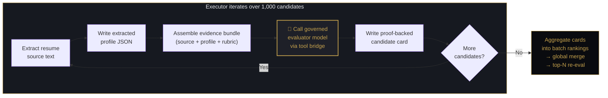
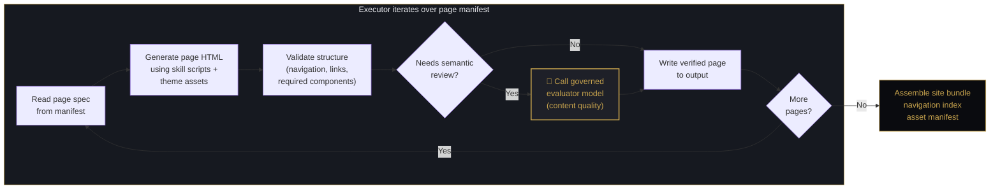
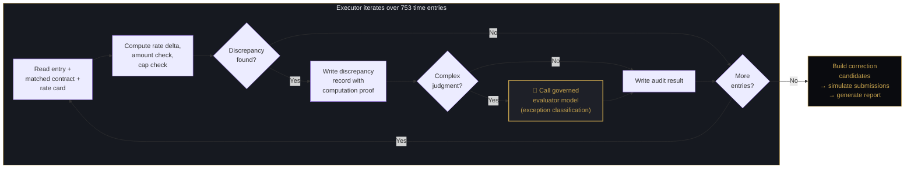
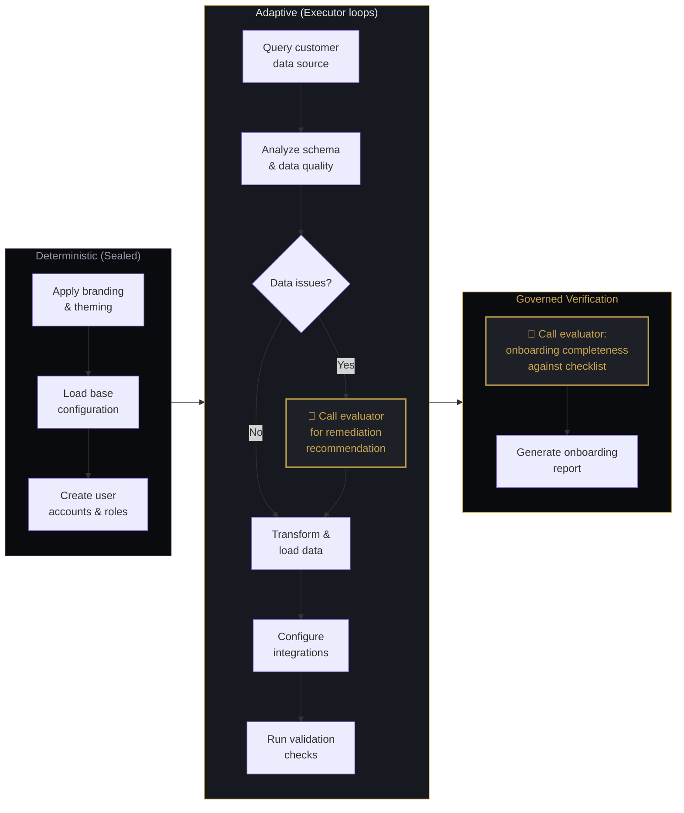
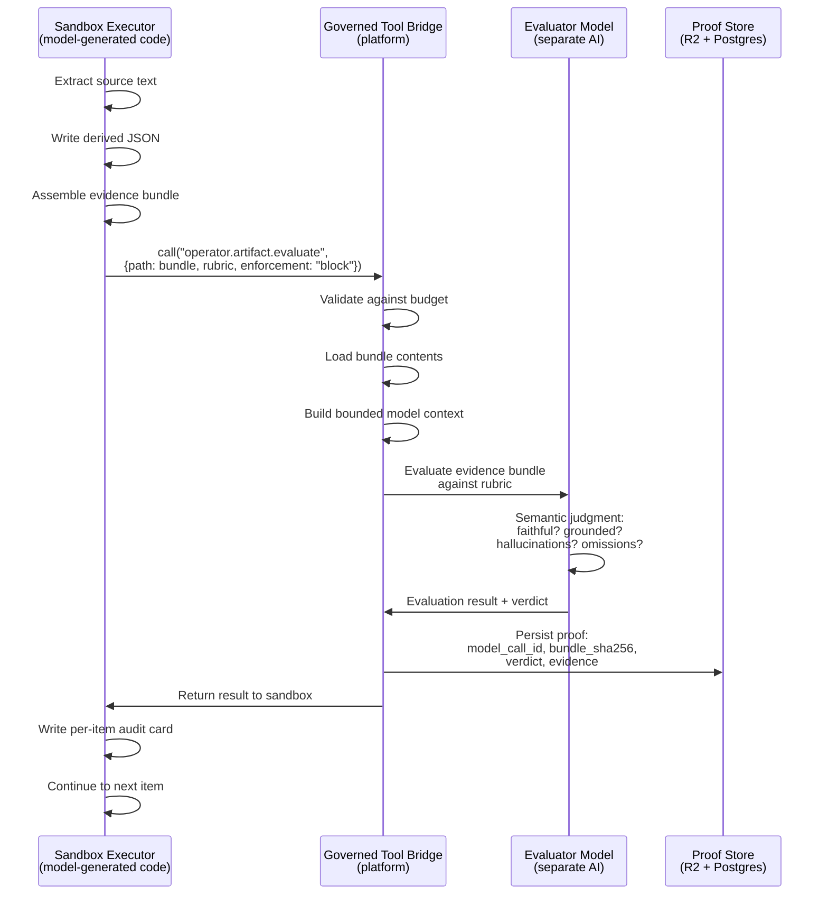
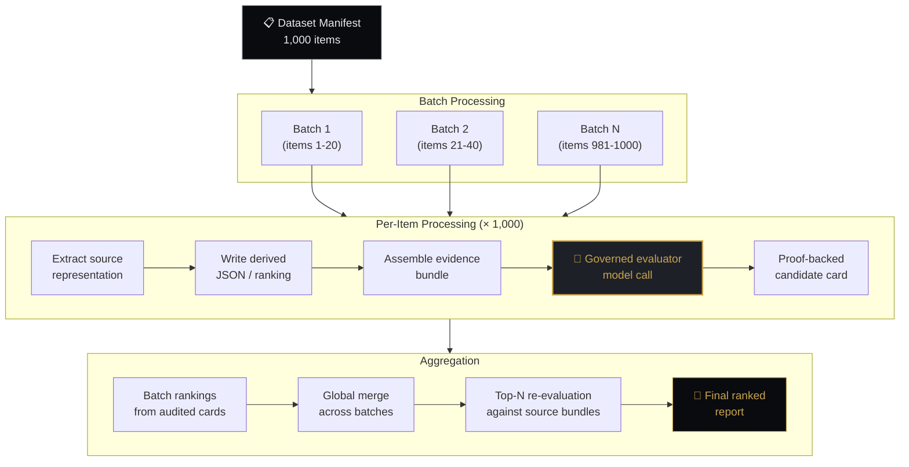
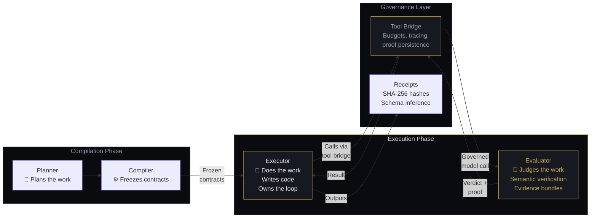
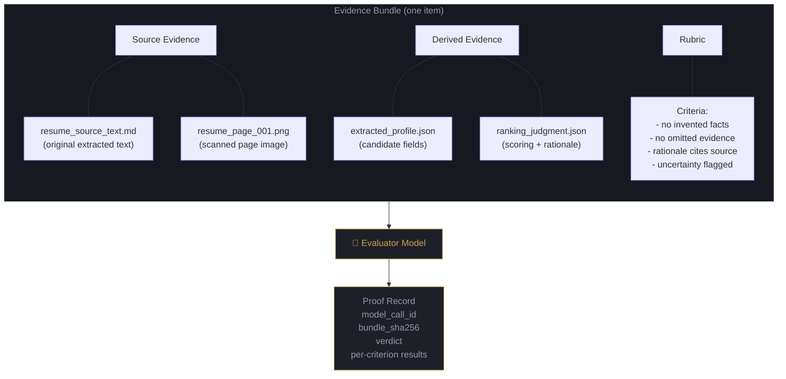

# Architecture Diagrams — Draft

> Review these Mermaid diagrams before placing them in documents.
> GitHub renders Mermaid natively in markdown. For the website, we'll need to decide rendering approach.

---

## Diagram 1: The Compilation Pipeline

Shows the 5-pass flow from user intent to governed execution.

---

## Diagram 2: The Step Harness — General Architecture

The executor's code is not limited to one pattern. It can compute, iterate, call governed evaluators, write files, adapt — whatever the contract requires. The harness wraps it with verification.

---

## Diagram 2a: Example — Resume Screening (1,000 candidates)

The executor loops over candidates, assembles per-item evidence bundles, and calls a governed evaluator model per item.

---

## Diagram 2b: Example — Building a Website (500 pages)

The executor iterates over a page manifest, generates each page individually, and optionally calls a governed evaluator for quality verification.

---

## Diagram 2c: Example — Billing Audit (753 entries)

The executor iterates over time entries, performs computational reconciliation, and calls the governed evaluator for complex judgment items.

---

## Diagram 2d: Example — Customer Onboarding

Mix of deterministic steps (sealed capsule segments) and adaptive steps where the executor queries data mid-workflow and adjusts.

---

## Diagram 3: Governed Evaluator — The Tool Bridge

Shows how the sandbox executor calls the evaluator model through the platform's governed tool bridge.

---

## Diagram 4: Hierarchical Processing at Scale

Shows how 1,000 items are processed through iteration, not context stuffing.

---

## Diagram 5: Executor + Evaluator — Separation of Concerns

Shows this as an architectural principle, not a sandbox implementation detail.

---

## Diagram 6: Evidence Bundle Structure

Shows what the evaluator model actually receives.

---

## Where these diagrams should go

| Diagram | Document | Location |
|---------|----------|----------|
| 1. Compilation Pipeline | Thesis Part V, Section 5.1 | After the text pipeline overview |
| 2. Step Harness with Loop | Thesis Part VI, Section 6.3 | Replace the text-only harness description |
| 3. Governed Tool Bridge | Thesis Part VI, new section 6.x | Between executor and verification |
| 4. Hierarchical Processing | Thesis Part X-b | In the resume screening use case |
| 5. Executor + Evaluator | Thesis Part VI, Section 6.1 or new section | Architectural elevation of the evaluator concept |
| 6. Evidence Bundle | Thesis Part VI or new section | Alongside the governed evaluator description |

For the **founder note**, diagrams 3 (tool bridge sequence) and 5 (executor + evaluator separation) are the most relevant — they show the architecture without overwhelming a shorter document.

For the **landing page**, diagram 5 could be simplified into a visual on the page, but Mermaid won't render in Astro without a plugin. We'd need to render it as an SVG or image.
