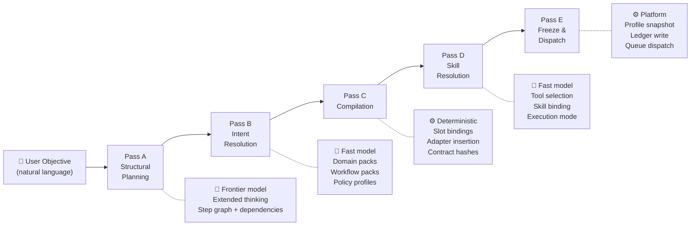
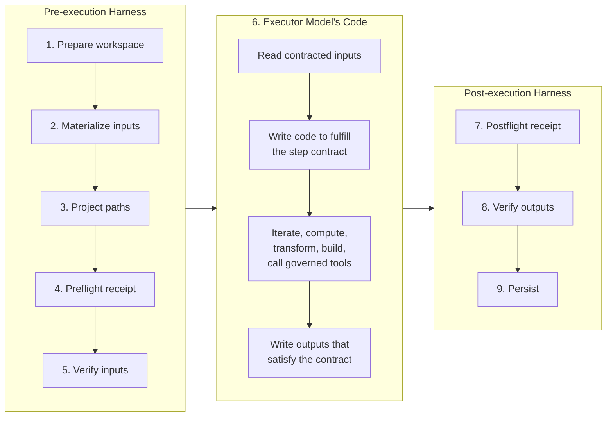
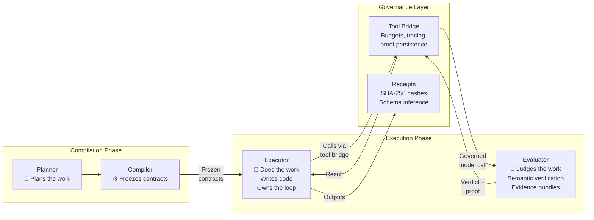
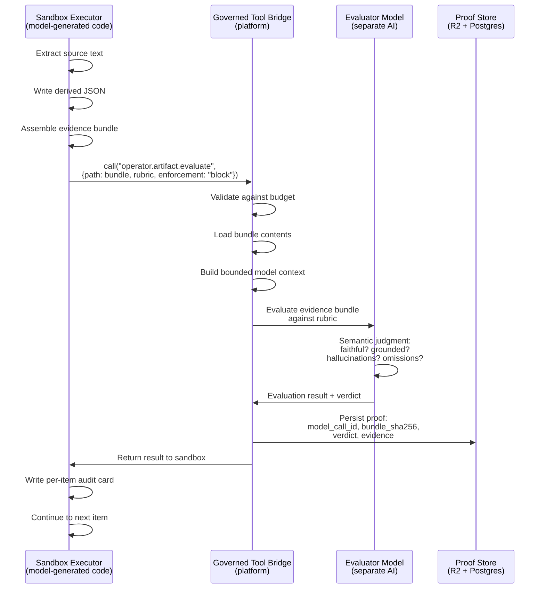
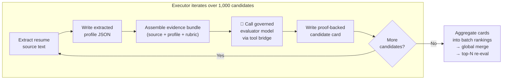
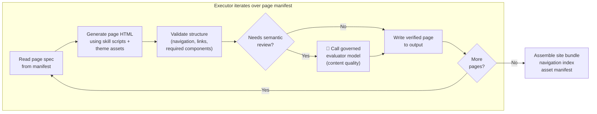
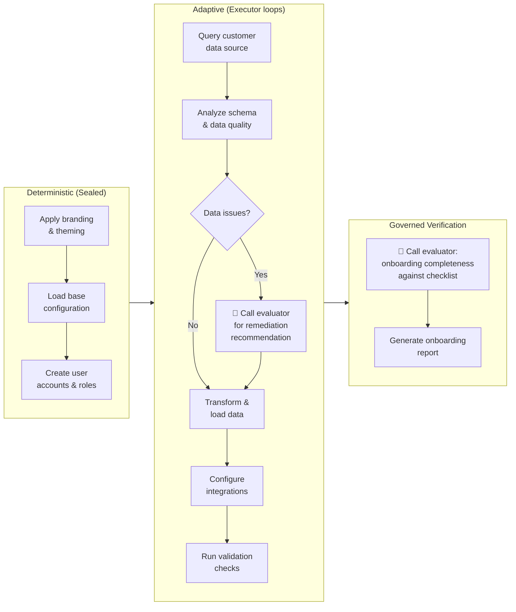

# The Forge Architecture Thesis
## A compiler for autonomous work

**Simone Coelho**
Founder, Amadalis
April 2026

> This document is the canonical technical reference for the Forge architecture. It is the deeper treatment behind the [founder research note](/research/compiling-autonomous-work), which introduces the thesis and shows selected evidence. This document shows the system.
>
> Every claim is classified: **proven** (implemented and shipping), **partial** (implemented in some paths), or **designed** (architecturally specified but not yet in the shipping runtime). The boundaries section at the end provides a full accounting.

---

# Part I — The Problem

## 1.1 The interpreter pattern

The dominant architecture for autonomous AI systems follows a pattern that compiler engineers recognize immediately: interpretation.

A model receives a task. It decides what to do. It reaches for a tool. It observes the result. It decides again. This cycle repeats until the model believes the task is complete or the system runs out of budget.

This architecture — read, act, observe, decide, repeat — has proven that models can do real work. That part is genuine. When models get a real environment with file access, code execution, and tools, they produce real outputs. The question is not whether the interpreter pattern works. The question is whether it works reliably enough, at sufficient scale and duration, for work that matters.

After eighteen months of building autonomous systems for enterprise work — long-horizon plans, multi-step execution, real APIs, real data, real deliverables — I believe the answer is no. Not because the models are inadequate. Because the architecture is.

## 1.2 A taxonomy of structural failures

These are not abstract categories. They are failure classes I observed repeatedly across different frameworks, harnesses, and orchestration patterns. Every one of them is a structural problem, not an intelligence problem.

**Late discovery.** Step 12 discovers that step 3 should never have been attempted — the upstream output is in the wrong format, or a required capability does not exist, or the dependency was never satisfiable. By step 12, steps 4 through 11 have already consumed tokens and time. In a compiler, this would have been caught during type checking before any code ran.

**Contract mismatch.** A downstream step receives data it cannot consume. Step 3 expects an artifact that step 2 was supposed to produce, but step 2 produced something with a different schema, different field names, or different granularity. Nobody checked whether the output of step 2 satisfies the input contract of step 3 before execution started.

**Capability hallucination.** The model references a tool that does not exist, a skill that was never registered, or an internal ID it invented. It sounds plausible. It compiles in the model's imagination. It fails at runtime. In a compiler, this is an unresolved symbol — caught at link time, not at execution time.

**Context decay.** Long-running sessions where step 20 carries the accumulated fog of steps 1 through 19 — every retry, every dead end, every intermediate tool output. The model's reasoning becomes measurably less precise because it is drowning in its own history. The system has no mechanism to give step 20 a clean start.

**Self-reported completion.** The model says "done." But the output is wrong, missing, or malformed. The system trusted the model's self-report instead of independently verifying that the declared outputs exist, match the expected schema, and pass semantic checks. In any serious engineering discipline, the producer does not get to mark its own homework.

**Semantic drift.** For example, `customer_id` in one API surface, `user_id` in another. Same platform, same semantics, different words. The model's intent is correct every time — it knows what it wants to do. But the inconsistency between API surfaces causes it to send the wrong field name, burn tokens on correction loops, and sometimes cascade the mismatch downstream where it becomes a silent data integrity failure.

**Schema overwhelm.** The model is given an OpenAPI specification with deeply nested objects. Some children are JSON, some are serialized text. Property descriptions reference constraint definitions in other parts of the schema. Accepted values are listed in a separate enum definition. The model has to hold all of these references in attention simultaneously while constructing a valid payload. On complex schemas, it cannot. Its intent is correct. The format of the information overwhelms its attention.

## 1.3 Three operational assumptions

These are not claims of final scientific certainty. They are architectural assumptions drawn from building and observing real systems — assumptions I now design around.

**Model quality is not stationary in practice.** The same nominal model can feel materially different across providers, runtimes, configurations, and moments in time. I am not asserting a proven causal mechanism. I am asserting an architectural consequence: if quality varies in practice, the system must be designed to survive that variance. You cannot build a production system on the assumption that the model will always perform at its best.

**Long-running context is a tax on reasoning quality.** As sessions accumulate tool outputs, errors, retries, observations, and intermediate artifacts, the model's reasoning becomes less precise. Even with compression, the system is carrying cognitive debt forward. I do not want step 20 inheriting the fog of steps 1 through 19. The architecture must isolate steps from each other's accumulated noise.

**Self-reported completion is not evidence.** If a model says "I did it," that is not proof. A trustworthy system needs receipts: expected outputs verified to exist, checksums confirming integrity, schema summaries confirming shape, and independent review confirming content. The verification infrastructure must be separate from the producing model.

---

# Part II — The Imprinting Protocol

## 2.1 Why JSON schemas fail for models

The first discovery came from a specific, ugly, real engineering problem.

The company I work at has deeply nested API endpoints. Some child objects are JSON, others are raw text requiring different serialization. Two different platform surfaces call the same entity different things — for example, `customer_id` in one API, `user_id` in another. Same platform, same semantics, different words.

The obvious approach was to give the model the OpenAPI specifications. Full JSON schemas with property descriptions, accepted values, constraints, and validation rules. Everything the model should need to construct a correct payload.

It failed reliably on complex schemas. Not because the model did not understand the intent — its intent was always correct. The problem was the format of the information. In a typical OpenAPI schema, the accepted values for a field are defined in one location, the property constraints in another, the format requirements in a third. The model has to hold all of these references in attention simultaneously while constructing a deeply nested payload. On schemas with four or five levels of nesting and mixed serialization, the model loses track. It sends the wrong field, gets corrected, sends a different wrong field, gets corrected again. Tokens burn. The model's intent was right every time.

This was my first real insight, and it has nothing to do with prompt engineering. It has to do with how information is structured for model consumption.

## 2.2 The template token language

The model needs information to be self-describing at the point of use. Not "see the documentation for accepted values." Not "refer to the constraint definition in section 4.2 of the schema." Every property must carry its own accepted values, its own constraints, its own format — right where the model reads it.

This led to a formal template token language. The normative token types:

| Token | Purpose | Example |
|-------|---------|---------|
| `{FILL\|type}` | Required input the model must provide | `{FILL\|string}` |
| `{OPTIONAL\|type}` | Optional input, may be omitted | `{OPTIONAL\|string}` |
| `{AUTO\|type\|constraint}` | System-calculated, model does not fill | `{AUTO\|string\|format:uuid}` |
| `{FILL_ENUM\|values}` | Required, must pick from enumerated values | `{FILL_ENUM\|active\|paused\|archived}` |
| `{OPTIONAL_ENUM\|values}` | Optional, pick from enum or omit | `{OPTIONAL_ENUM\|none\|preferred\|required}` |

Constraint modifiers extend any token: `format:uuid`, `range:1-100`, `pattern:lowercase_underscore`. The model sees the constraint inline with the field, not in a separate definition.

The critical design rule is the **200-character rule**: behavioral instructions come first, data skeleton second. The first 200 characters of any template determine whether the model locks onto the correct pattern. Type and structure in characters 0-50. Severity and headline in 50-100. Constraints and boundaries in 100-150. Next actions in 150-200. After that, the data skeleton follows.

## 2.3 Recursive nested traversal

The serializer handles nesting through recursive traversal, not flattening. Objects stay nested in the template. Arrays get a representative element showing the expected shape. Leaf nodes get tokens.

A nested schema like this:

```json
{
  "customer": {
    "id": "{AUTO|string|format:uuid}",
    "profile": {
      "name": "{FILL|string}",
      "status": "{FILL_ENUM|active|paused|archived}",
      "tags": ["{OPTIONAL|string}"]
    }
  }
}
```

The model sees the nested structure preserved. It sees that `id` is auto-generated (don't fill it). It sees that `name` requires a string, `status` requires one of three values, and `tags` is an optional array of strings. Everything is at the point of use.

The traversal handles `$ref` dereferencing — following schema references to their definitions. Circular references are guarded with `{REF: circular}` markers and a max depth hard-stop, preventing infinite recursion in self-referencing schemas.

## 2.4 The bidirectional serializer

The template language is only half the mechanism. The other half is the serializer engine that makes it bidirectional.

The serializer takes any valid JSON schema — an OpenAPI spec, a Swagger file, whatever the customer has — and translates it into a self-describing template through recursive traversal. The template is the menu. The model is the customer placing an order.

The model fills in the template. It picks from the enumerations. It provides the values it wants to send. Then the filled template goes back through the serializer, and out the other side comes the correct API payload — properly nested, properly serialized, right field names, right structure.

```
JSON Schema (OpenAPI, Swagger, custom)
       ↓
  [ Serializer — recursive traversal ]
       ↓
  Self-describing template (the menu)
       ↓
  Model fills the template (places an order)
       ↓
  [ Serializer — inverse translation ]
       ↓
  Valid API payload (properly nested, serialized)
```

The model never touches the raw API. It never worries about nesting depth, serialization formats, or schema structure. It says what it wants. The infrastructure translates.

This is the inversion that everyone in the industry describes abstractly — "let the AI focus on intent, not mechanics." The serializer is the actual mechanism. Menu in, order out, payload delivered.

## 2.5 The planner template

The imprinting protocol extends far beyond API calls. It drives the planner itself. The planner does not receive a free-form prompt and return unstructured text. It receives a self-describing template and fills it in.

Here is a fragment of the actual Pass A output contract — the template the planning model receives:

```json
{
  "label": "{imperative verb phrase}",
  "objective": "{MUST/SHOULD/MAY objective template string}",
  "expected_outputs": [{
    "path": "{Class A user-deliverable path with recognized extension}",
    "role": "{artifact role}"
  }],
  "success_criteria": "{machine-checkable outcome}",
  "abstract_inputs": [{
    "slot": "{FILL|string}",
    "required": "{FILL|boolean}",
    "entity_schema_id": "{FILL|string}",
    "accepted_kind_keys": ["{OPTIONAL|string}"],
    "provenance_policy": "{OPTIONAL_ENUM|none|preferred|required}"
  }],
  "abstract_outputs": [{
    "slot": "{FILL|string}",
    "entity_schema_id": "{FILL|string}",
    "preferred_kind_keys": ["{OPTIONAL|string}"]
  }],
  "artifact_contracts": {
    "{expected_outputs[].path}": {
      "format": "{ENUM|json|csv|parquet|html|md|txt|pdf|yaml|tsv|other}",
      "required_top_level_type": "{OPTIONAL_ENUM|array|object|table}"
    }
  },
  "semantic_hints": {
    "domain_terms": ["{OPTIONAL|string}"],
    "workflow_terms": ["{OPTIONAL|string}"],
    "policy_terms": ["{OPTIONAL|string}"]
  }
}
```

Every field tells the model exactly what to produce. The model generates plans that span a hundred steps with a thousand sub-steps — with perfect structural fidelity. The model was never the bottleneck for plan generation. The way we were talking to it was.

## 2.6 What the imprinting protocol made possible

With the serializer and template language in place, a fundamental capability unlocked: the model can reliably generate arbitrarily complex structured contracts. Not because the model got smarter. Because the communication protocol between the system and the model was redesigned around how models actually process information.

This is the foundation everything else is built on. The validation ladder, the type system, the compilation pipeline, the step contracts — all of them depend on the model being able to generate complex structured output with perfect fidelity. Without the imprinting protocol, none of the downstream architecture would work.

---

# Part III — The Validation Ladder

## 3.1 The relationship between imprinting and validation

The imprinting protocol solves the generation problem. The model can produce the right structural shape with the right field types.

But shape is not correctness. Who checks that the values are right? That `customer_id` maps to what the downstream API actually expects? That business rules are enforced — rate limits, required fields, conditional constraints? That semantic drift between two platforms' vocabulary is handled before it causes a silent failure three steps downstream?

You cannot ask the model to be careful. Careful is not a system property. Careful is a hope.

The validation ladder is the structural answer to correctness. It is a multi-stage pipeline that mechanically and semantically checks every payload after it has been produced — catching and correcting errors before they propagate.

The relationship is sequential: imprinting produces the payload, the ladder validates and corrects it. They are complementary systems. Neither works well without the other.

## 3.2 Stage-by-stage breakdown

The validation ladder runs through 11 stages, organized into 7 levels (L0 through L6). Eight stages are fully deterministic. Three are AI-powered with guardrails.

### L3 — Guard (deterministic)

Runs first, despite the numbering. This is the security perimeter. It screens for PII exposure, API key leakage, and content that should never pass through the pipeline regardless of what follows. If L3 flags a payload, processing stops.

### L0 — Schema (deterministic)

Base structural parsing and normalization. Validates that the payload is well-formed — valid JSON, expected top-level type, required structural properties present. This is the equivalent of a syntax check.

### L0b — Synonym resolution (deterministic)

Renames fields to their canonical names using a configured synonym map. This is where `customer_id` becomes `user_id`, where `alloc_pct` becomes `allocation_percentage`, where platform-specific terminology is normalized to the system's canonical vocabulary.

This stage is the mechanical answer to the semantic drift problem. The model may use either term — and be correct in either case — but the downstream system needs one canonical name.

### L0c — Structural fix (deterministic)

Fixes structural problems that are not semantic errors. A JSON string that should be a parsed object gets parsed. An array wrapped in an unnecessary outer object gets unwrapped. These are formatting corrections, not value corrections.

### L0d — Default injection (deterministic)

Adds missing optional fields with configured default values. If a payload omits `status` and the contract specifies a default of `active`, this stage adds it. The model did not need to know the default — the system injects it.

### L0e — Business transforms (deterministic)

Applies configured business rules. Title-cases name fields. Scales numeric fields between units. Applies conditional transformations. These are deterministic, rule-driven corrections that enforce organizational conventions.

### L1 — Vector rename (AI-powered)

When L0b's synonym map does not cover a field name, L1 uses vector similarity to find the most likely canonical mapping. `allocation_pct` becomes `weight` not because of a hardcoded synonym rule but because the vector distance between the two names, in the context of this domain, suggests they refer to the same concept. This stage is probabilistic and guarded — if confidence is below threshold, the field is flagged for review rather than silently renamed.

### L2 — Guarded JSON Patch (AI-powered)

Fixes value-level errors within strict guardrails. `ACTIVE` becomes `active` (case normalization). A date in MM/DD/YYYY becomes YYYY-MM-DD. The model proposes a patch; the patch is validated against the contract before application. The guardrails prevent the AI from making changes that violate the schema — it can only fix values, not invent structure.

### L4 — Contract conformance (deterministic)

Validates the payload against the full type contract. Strips fields that are not in `allowed_keys`. Verifies required fields are present. Checks type constraints. This is the equivalent of a type-checker pass — the payload either conforms to the contract or it does not.

### L5 — Domain validators (deterministic)

Domain-specific validation rules that go beyond structural conformance. Range checks (is this percentage between 0 and 100?). Cross-field consistency (does `end_date` come after `start_date`?). Business constraint validation (does this rate exceed the contract cap?). These are deterministic rules configured per domain.

### L6 — Expert AI (AI-powered)

Deep semantic validation and correction. Can extract a numeric value from text like `"should_be_150"` → `150`. Can detect that a field labeled "revenue" contains cost data based on the values and context. Can flag that a legal clause summary contradicts the source document. This is the most powerful and most expensive stage — used when deterministic checks cannot catch the error class.

## 3.3 Where the ladder runs

The ladder is not a single global filter. It runs in multiple contexts, configured per execution profile:

- **Data ingestion and import validation** — when OpenAPI specs or external data enter the system
- **Planner candidate validation** — checking the abstract plan before compilation
- **Step input validation** — checking the materialized inputs before the executor runs
- **Step output validation** — checking the produced outputs before they flow downstream
- **Final output validation** — checking deliverables before they reach the user

Not all stages run in all contexts. The execution profile defines which validation phases are active and which stages are enforced for each phase. A strict compliance profile might run every stage on every phase. A fast prototyping profile might run only L3 guard and L0 schema.

## 3.4 From validation to semantic translation

This is the bridge to the type system.

If L0b understands that `customer_id` and `user_id` are semantically the same entity, that is not just error correction. That is a translation layer. The same mechanism that corrects field name mismatches can bridge semantic gaps between entirely different platform schemas.

Take two OpenAPI specifications — one from Shopify, one from Stripe. Different field names, different nesting, different conventions. The validation ladder, combined with the imprinting protocol, can translate between them: the serializer produces templates for both schemas, the model fills the templates using its understanding of the intent, and the ladder maps the field names to the correct canonical representations for each target platform.

The validation pipeline became a semantic translation layer. The translation layer became the foundation for cross-platform interoperability. Each layer I built exposed the next problem. Each solution revealed the next gap.

---

# Part IV — The Type System for Autonomous Work

## 4.1 Why a type system

The imprinting protocol gives the model a language. The validation ladder gives it correctness. But as plans grow beyond a handful of steps, a deeper problem emerges.

When a user says "audit the billing," what does that actually mean to the system? What data types are involved? Time entries? Rate cards? Invoice line items? What is the workflow — comparing two sources, or scoring one? What vocabulary applies? What are the disambiguation boundaries — is this a billing audit or a financial analysis or a security audit?

Without a type system, the planner guesses. A planner that guesses is an interpreter.

## 4.2 Domain packs

A domain pack is a standard library for a business domain. It tells the system everything it needs to know about a class of work: the entity types that appear, the vocabulary that triggers it, and the disambiguation rules that separate it from similar-sounding work.

### billing-audit

```json
{
  "domain_pack_id": "billing-audit",
  "purpose": "Reconcile time, rates, contracts, or invoice lines. Determine
    what should be billed, what was billed incorrectly, or where billing
    discrepancies exist.",
  "entity_schemas": [
    "billing.time_entry",
    "billing.rate_card",
    "billing.invoice_line_item",
    "billing.discrepancy_row",
    "billing.billing_summary"
  ],
  "triggers": [
    "billing audit", "invoice discrepancies",
    "timesheet reconciliation", "billable hours"
  ],
  "disambiguation": [
    "Use billing-audit when matching time, rates, contracts, or invoice lines.
      Use finance-analysis when the mission is about ledger entries, budgeting,
      or financial performance.",
    "If the user mentions 'audit' in a controls/compliance context,
      use security-audit instead."
  ],
  "example_goals": [
    "Audit these timesheets against the rate cards and tell me what to invoice.",
    "These invoices don't add up — find the billing errors.",
    "Match the hours logged against what was actually billed and flag discrepancies."
  ]
}
```

### legal-review

```json
{
  "domain_pack_id": "legal-review",
  "purpose": "Analyze contracts, policies, legal text, obligations, liabilities,
    or clause-level risk.",
  "entity_schemas": [
    "legal.document_summary",
    "legal.clause_finding",
    "legal.obligation_row",
    "legal.risk_finding"
  ],
  "triggers": [
    "contract review", "legal review", "redlines",
    "obligations", "termination clause", "indemnity"
  ],
  "disambiguation": [
    "Use legal-review when the primary source material is contracts, policies,
      NDAs, MSAs, SOWs, or other legal text. Use research-synthesis when the
      task is collecting external sources about laws or regulations.",
    "Use legal-review rather than billing-audit when a contract is being
      analyzed for legal meaning, even if billing clauses are present."
  ]
}
```

### resume-audit

```json
{
  "domain_pack_id": "resume-audit",
  "purpose": "Batch-load resumes or CVs, extract structured candidate
    information, compare candidates against a rubric or role description,
    and produce rankings, audit tables, or hiring summaries.",
  "entity_schemas": [
    "resume.candidate_document",
    "resume.candidate_profile",
    "resume.resume_audit_row",
    "resume.job_requirement"
  ],
  "triggers": [
    "resume audit", "screen resumes", "rank candidates",
    "batch load cv files", "candidate scoring"
  ],
  "disambiguation": [
    "Use resume-audit when the inputs are candidate resumes, CVs, or
      applicant profiles and the mission is evaluation or ranking.
      Use research-synthesis when the task is researching people from
      external sources rather than scoring resumes."
  ]
}
```

The disambiguation rules are the critical engineering. They prevent misrouting — the system knows that "billing audit" is not "finance analysis," that "contract review" in a legal context is not "security audit," that "research people" is not "screen resumes." Every domain pack carries its own disambiguation boundary.

There are 12 domain packs today: research-synthesis, investigation-core, resume-audit, billing-audit, finance-analysis, legal-review, website-build, code-modification, data-merge-transform, sales-crm, psa-capacity, security-audit. Each carries entity schemas, triggers, example goals, disambiguation rules, and synonym vocabulary.

## 4.3 Workflow packs

Domain packs say what the data is. Workflow packs say how the work flows.

A workflow pack defines the operational semantics for a class of transformation — what goes in, what comes out, and what the work means.

### reconcile-compare

```json
{
  "workflow_pack_id": "reconcile-compare",
  "purpose": "Compare two or more compatible inputs to identify matches,
    mismatches, discrepancies, or missing records.",
  "typical_slots": {
    "inputs": ["normalized_rows", "joined_rows"],
    "outputs": ["findings", "scores", "report_artifact"]
  },
  "triggers": [
    "compare two sources", "find discrepancies",
    "reconcile datasets", "cross-reference and flag mismatches"
  ],
  "disambiguation": [
    "reconcile-compare requires two or more input sources.
      analyze-score-rank operates on one source.",
    "reconcile-compare emits discrepancy findings.
      normalize-transform emits reshaped data without comparison semantics."
  ]
}
```

### normalize-transform

```json
{
  "workflow_pack_id": "normalize-transform",
  "purpose": "Canonicalize fields, reshape structures, map enums, or convert
    one structured representation into another compatible one.",
  "typical_slots": {
    "inputs": ["normalized_rows"],
    "outputs": ["normalized_rows", "joined_rows", "aggregated_rows"]
  },
  "triggers": [
    "normalize rows", "reshape into canonical schema",
    "map fields and enums", "convert structured data"
  ],
  "disambiguation": [
    "normalize-transform changes shape or conventions of structured data.
      reconcile-compare requires two or more sources and emits discrepancies.",
    "normalize-transform should not be used when the primary output is a
      score, ranking, or report artifact."
  ]
}
```

### render-report

```json
{
  "workflow_pack_id": "render-report",
  "purpose": "Turn findings, rows, scores, or summaries into a human-readable
    report artifact such as Markdown, HTML, PDF, or a styled document.",
  "typical_slots": {
    "inputs": ["findings", "normalized_rows"],
    "outputs": ["report_artifact"]
  },
  "triggers": [
    "generate report artifact", "render findings into report",
    "compose deliverable", "build human-readable summary"
  ],
  "disambiguation": [
    "render-report is for presentation of already-produced findings or data.
      It should usually come after analysis, scoring, or reconciliation.",
    "Use render-website when the output is a deployable web bundle rather
      than a conventional report artifact."
  ]
}
```

There are 12 workflow packs: file-acquisition, file-batch-load, ingest-materialize, normalize-transform, reconcile-compare, analyze-score-rank, research-fetch-summarize, render-report, render-website, code-modification, deploy-publish, investigation-parallel.

## 4.4 Artifact kinds and cross-step slots

The type system has two more dimensions beyond domain and workflow.

**Artifact kinds** define the representation format. There are 24 kinds organized into families:

- **Files**: file.binary, file.text, file.archive.zip, file.batch_manifest
- **Objects**: object.json, object.yaml
- **Tables**: table.csv, table.tsv, table.json_rows, table.parquet
- **Datasets**: dataset.joined_rows, dataset.aggregated_rows
- **Reports**: report.markdown, report.html, report.pdf
- **Web**: web.page.html, web.bundle.static, web.asset_manifest
- **Deployment**: deployment.receipt
- **Code**: code.patch.unified_diff, code.bundle.project
- **Validation**: validation.results
- **Evidence**: evidence.json_rows, citations.list

**Cross-step slots** define the semantic role of data flowing between steps. There are 15 standard slots: source_manifest, raw_files, batch_manifest, document_spans, normalized_rows, joined_rows, aggregated_rows, findings, scores, report_artifact, site_spec, site_bundle, deployment_receipt, validation_results, change_set.

The naming convention is itself a type system:
- `kind_key`: `<family>.<representation>[.<subtype>]` — e.g., `table.json_rows`
- `entity_schema_id`: `<domain>.<entity>` — e.g., `billing.time_entry`
- `profile_id`: `<scope>.<kind_key>.<semantic_name>.v<major>` — e.g., `billing.table.json_rows.time_entries.v1`

## 4.5 Policy profiles

Five policy profiles govern how strictly the compiler and runtime enforce contracts:

**`strict.fail-closed.v1`** — Maximum strictness. Required fields must be present, no implicit normalization, mismatch blocks execution, provenance enforced exactly. For compliance-critical work, financial and legal audits, regulatory reporting.

**`strict.allow-normalizers.v1`** — Strict with explicit flexibility. Adapters may be inserted automatically, but no implicit inference beyond declared adapters. For multi-source workflows, billing and resume pipelines.

**`generic.inference-allowed.v1`** — Best-effort flexibility. The compiler may bind generic profiles when specificity is absent. For exploratory analysis, prototypes, loosely structured inputs.

**`provenance.required.v1`** — Source IDs required, citation IDs and evidence required where declared, blocks publish if missing. For research, legal, and audit outputs.

**`deploy.human-review-required.v1`** — Deployment or external side effects require explicit approval. For deploying websites, publishing builds, creating customer-visible outputs.

## 4.6 Compatibility and adapters

When the compiler resolves slot bindings between steps, it uses a 5-rank compatibility algorithm:

1. **Exact match** — same profile_id, entity_schema, kind_key, and grain. Direct connection.
2. **Same entity, acceptable kind** — same semantic entity, representation is in the consumer's accepted list. Compatible.
3. **Same entity, adapter available** — same semantic entity, different representation, but a registered adapter exists to translate. Adapter is inserted automatically.
4. **Generic compatible** — no specific profile match, but the generic profile is compatible under the active policy. Allowed only under `generic.inference-allowed.v1`.
5. **Incompatible** — different semantics, no adapter, or policy prohibits. Compiler rejects the binding.

The hard rule: no "close enough." The compiler either finds a valid binding or fails. There is no silent fallback to best-effort matching. This is the type-checker of the system.

## 4.7 Extensibility

The 12 domain packs and 12 workflow packs are a starting library. The system is designed for custom packs. If an organization needs a domain pack for insurance claims processing, clinical trial analysis, or manufacturing quality control, they build it and register it.

Building a domain pack means defining: entity schemas, trigger patterns, disambiguation rules, synonym vocabulary, canonical profiles, and example goals. Building a workflow pack means defining: purpose, typical input/output slots, trigger patterns, disambiguation rules, and canonical profiles.

The consequence: every new domain pack extends what the compiler can compile correctly. Every new workflow pack extends the operational vocabulary. The type system grows with usage — the same way a programming language's standard library grows over time.

---

# Part V — The Compilation Pipeline

## 5.1 Overview

The compilation pipeline transforms a human objective expressed in natural language into a set of governed, executable step contracts. It runs through five passes:



Three of the five passes involve model intelligence (A, B, D). One is fully deterministic (C). One is infrastructure orchestration (E). The most expensive model call — the planner — happens once. Everything after it is either cheap model calls (B, D) or deterministic computation (C, E).

## 5.2 Pass A — Structural planning

The planner receives the user's intent message and produces a `PlannerCandidate`: a structured plan with mission, abstract steps, dependencies, and success criteria.

The planner uses the imprinting protocol — it fills in a self-describing template rather than generating free-form output. This is how it produces complex plans with perfect structural fidelity.

A concrete Pass A output for a "Render HTML report" step:

```json
{
  "label": "Render HTML report",
  "objective": "Produce an executive report from analysis.json",
  "depends_on": ["analyze"],
  "input_file_paths": ["output/analysis.json"],
  "expected_outputs": [{
    "path": "output/report.html",
    "location": "sandbox",
    "role": "primary"
  }],
  "success_criteria": "output/report.html exists and is a valid HTML document"
}
```

What Pass A does NOT include: frozen io_contract, executable_contract_v2, materialized paths, contract_hash, tool assignments, or skill bindings. It is abstract structure — the equivalent of a parsed AST before type checking.

## 5.3 Pass B — Intent resolution

The intent resolver annotates each step with semantic context. It receives the compact pack catalog and assigns domain packs, workflow packs, and a policy profile to each step.

The same step after Pass B:

```json
{
  "...Pass A fields": true,
  "domain_pack_ids": ["reporting"],
  "workflow_pack_ids": ["render-report"],
  "policy_profile_id": "strict.allow-normalizers.v1",
  "resolution_status": "resolved",
  "confidence": 0.92,
  "reason": "step objective matches render-report triggers",
  "warnings": []
}
```

Pass B annotates the plan. It does not freeze runtime paths. It is symbol annotation — telling the compiler what type libraries apply to each step.

## 5.4 Pass C — Compilation

This is the core deterministic pass. The `compilePlan()` function transforms abstract, annotated steps into concrete, frozen step contracts. It performs:

1. **Validate planner candidate** — structural checks on the abstract plan
2. **Load artifact-contract-library snapshot** — the current state of the type system
3. **Resolve library-backed output contracts** — match expected outputs to registered artifact contracts
4. **Normalize file wiring** — canonicalize all input/output paths
5. **Resolve input/output slot bindings** — using the 5-rank compatibility algorithm
6. **Insert adapters** — when profiles are incompatible but an adapter can bridge them
7. **Choose step_kind, backend, routing** — decide how each step will execute
8. **Compute validator and repair policy** — determine what validation runs and how failures are handled
9. **Finalize executable attempt contract** — freeze the io_contract, execution_contract, artifact_contracts, and compute contract_hash (SHA-256)

The same step after Pass C:

```json
{
  "...Pass B fields": true,
  "step_id": "step_3",
  "compiled_step_contract_v1": {
    "inputs": [{"slot": "analysis_data", "path": "output/analysis.json", "required": true}],
    "outputs": [{"slot": "report", "path": "output/report.html", "kind_key": "report.html"}]
  },
  "artifact_contracts": {
    "output/report.html": { "kind_key": "report.html", "format": "html" }
  },
  "executable_contract_v2": {
    "step_inputs": [...],
    "step_outputs": [...],
    "execution_policy": { "repair_strategy": "retry_same_contract", "max_retries": 6 }
  },
  "contract_hash": "sha256:a4f7c29e..."
}
```

The contract hash seals the entire specification. After this point, the step contract is immutable. If the compiler cannot resolve the slot bindings — if a downstream step expects an artifact that no upstream step produces, or if the profiles are incompatible and no adapter exists — the compiler rejects the plan and fails the run. There is no automatic "bounce back to Pass A and replan" — rejection is terminal for that submission.

## 5.5 Pass D — Skill resolution

After compilation, the skill resolver selects the tools and skills for each step. It receives the compiled step contract plus candidate tools and skills discovered through hybrid retrieval (Postgres capability registry as source of truth, Vectorize as ranking signal).

The same step after Pass D:

```json
{
  "...Pass C fields": true,
  "allowed_tool_ids": ["sandbox.session"],
  "recommended_skill_ids": ["skill.html-report-generator"],
  "execution_mode": "code",
  "skill_binding_expectation": { "skill_usage_mode": "required" }
}
```

The skill resolver sees the compiled contract — it knows what the step must produce. The system discovers what is available. The model selects from what was discovered. If a skill does not exist in the registry, it cannot appear in the binding.

After skill resolution, the system recompiles to incorporate the bindings into the frozen contract.

## 5.6 Pass E — Contract finalization and dispatch

The run is written to the ledger. An execution-profile snapshot is frozen — capturing the exact configuration (models, prompts, validation phases, budgets, skill policy) that will govern this execution. Then the run is queued for execution or sent to a `RunExecutorDO` (Durable Object).

The final dispatch packet for each step contains:

```json
{
  "current_step": {
    "io_contract": { "read_paths": [...], "write_paths": [...] },
    "execution_contract": { "pattern": "...", "tool_budget": 10 },
    "artifact_contracts": { "output/report.html": {...} },
    "skill_bindings": [{ "skill_id": "skill.html-report-generator" }],
    "materialized_skill_packages": [{ "skill_id": "...", "paths": [...] }]
  }
}
```

At this point, the step is fully compiled, fully bound, and ready for execution. The executor model will receive this packet and work within its constraints.

## 5.7 One step through all five passes

To make the progression concrete, here is the same step — "Render HTML report" — at each stage:

| Pass | What was added | What it means |
|------|---------------|---------------|
| A | label, objective, depends_on, expected_outputs | The planner decomposed the intent into structure |
| B | domain_pack_ids, workflow_pack_ids, policy_profile_id | The intent resolver annotated it with semantic context |
| C | compiled_step_contract_v1, artifact_contracts, contract_hash | The compiler resolved slot bindings and froze the contract |
| D | allowed_tool_ids, recommended_skill_ids, execution_mode | The skill resolver bound concrete capabilities |
| E | io_contract, execution_contract, materialized_skill_packages | The runtime froze the execution profile and dispatched |

Each pass adds a layer of concreteness. Pass A is abstract intent. Pass E is a frozen, immutable, executable specification. That is compilation.

---

# Part VI — The Executor and Sandbox

## 6.1 Code-Act: the model thinks in code

Most agent platforms give the model pre-built tools and let it pick which ones to call. The model becomes a dispatcher — selecting from a fixed menu of functions that someone else wrote.

That is not what happens here.

In this system, the executor model writes code. Not tool calls. Not function selections. Actual programs. When a step needs to compute billing discrepancies, the model does not call a `compute_discrepancies()` function. It writes a Python script that opens the data files, joins the records, applies the comparison logic, computes the discrepancies, and writes the result.

This matters for verification. If a model tells me "the average value is 47,000," I have to trust that statement. It could be hallucinated. If the model writes ten lines of code that reads the dataset, sums the values, divides by the count, and prints 47,000 — the answer is tied to computation, not to prediction. The code is inspectable. The execution is logged. The result is verifiable.

Prose can sound right while being wrong. Code either runs or it does not.

The executor is not limited to pure computation. When a step requires semantic judgment — evaluating whether an extracted resume profile is faithful to the source, or whether a contract clause deviates from the standard template — the executor's code calls governed platform tools through a tool bridge. The call goes through the platform, which handles the AI evaluation, enforces budgets, records provenance, and persists proof. The executor's code orchestrates the workflow; the platform governs every model call within it. For a thousand resumes, that means the executor loops over candidates, assembles a per-candidate evidence bundle, and calls the governed evaluator per item — bounded per-item calls, not one massive prompt.

## 6.2 The executor model

The compiler freezes the contract. The executor model decides how to fulfill it.

This is an important distinction: the compiler does NOT prescribe the executor's internal sub-step sequence. It freezes the specification — what must be consumed, what must be produced, what tools are allowed, what success criteria must be met. The executor model receives this contract and decides the approach: what code to write, how to structure the computation, which libraries to use, how many tool calls to make.

At the platform level, the executor operates through an iterative tool loop: model call → tool_use blocks → governed dispatch → tool results → next model call. The outer tool-call budget — typically 10 per step — governs this platform-level loop.

Inside the sandbox, the executor has a different kind of freedom. The model's code can iterate over entire datasets — looping over files, writing intermediate artifacts, and calling governed platform tools per item through a tool bridge. These inner governed calls (such as per-item evaluator calls) are separately metered through the tool bridge's own budget and governance mechanisms. A step processing 1,000 resumes makes 1,000 governed evaluator calls from within the sandbox — each bounded, traced, and proof-persisted by the platform — without exhausting the outer tool-call budget.

## 6.3 The system-owned harness

Around the executor's work, the system runs a fixed infrastructure harness:

1. **Prepare workspace** — create `/workspace/{input,work,output,meta}`
2. **Materialize inputs** — copy upstream verified outputs into the sandbox filesystem at the contract-declared paths
3. **Project input paths** — symlink upstream artifacts to the exact read paths the executor's code expects
4. **Generate preflight receipt** — hash all inputs, infer schema summaries, write a structured receipt
5. **Verify required inputs** — check every declared required input exists on disk
6. **→ Executor model's tool loop runs here ←**
7. **Generate postflight receipt** — hash all outputs, validate parse correctness, infer schema summaries, detect placeholder sentinels, write a structured receipt
8. **Verify expected outputs** — check every declared output file exists and is non-empty
9. **Persist outputs** — save sandbox outputs to durable workspace storage

The executor writes the business logic — step 6. The system generates the other eight. The model's creativity is wrapped in infrastructure that validates what went in and verifies what came out.

Step 6 is not necessarily a single linear script. For analysis and evaluation steps, the executor writes code that iterates over a dataset — processing each item individually, assembling evidence bundles, calling governed platform tools per item through the tool bridge, writing per-item audit results, and producing aggregate outputs. The harness treats this as one execution unit: whatever the executor's code does internally, the preflight receipt captures what went in and the postflight receipt captures what came out.

A real compiled sub-step from a production run — the model-generated business logic:

```json
{
  "sequence": 5,
  "label": "Fetch JSONPlaceholder datasets and write raw_api_data",
  "type": "python",
  "code": "import json\nfrom pathlib import Path\nfrom urllib.request import ...\nusers = fetch_json('/users')\nfor u in users:\n    posts = fetch_json(f'/users/{u[\"id\"]}/posts')\n    todos = fetch_json(f'/users/{u[\"id\"]}/todos')\n    ...\nwith out_path.open('w') as f:\n    json.dump(raw, f, indent=2)\nif not out_path.exists():\n    raise RuntimeError('Primary output missing')",
  "exit_code": 0,
  "duration_ms": 10227,
  "ok": true
}
```

The model wrote a Python script that calls 35+ API endpoints, structures the data, writes the result, and self-validates. The output path was injected by the compiler. The model cannot write to a different location.

### The step harness — visual overview



### Executor and evaluator — separation of concerns

The governed evaluator is not a sandbox implementation detail. It is a first-class architectural concept: the separation of execution from evaluation, with a governed tool bridge mediating every model call.



### The governed tool bridge — call sequence



## 6.4 Fresh mind per step

Each step executes without the context of prior steps. The executor receives its compiled contract, its verified inputs, and its allowed capabilities. It does not receive the history of the run. It does not know what happened before it. It does not carry forward any accumulated noise.

Steps typically start without assuming reuse of a prior step's container. The sandbox runtime can retain and reuse a warm container within the same step for continuations or repair iterations, but different plan steps are isolated from each other's execution context.

Step 300 is as sharp as step 1 — because for the executor, it is step 1.

## 6.5 Repair policy

When a step fails, the `CompiledOuterRetryPolicy` classifies the failure:

**Retryable failures** — infrastructure errors that a fresh attempt may resolve:
- `SANDBOX_SESSION_DEAD` — container crashed
- `SANDBOX_TRANSPORT_5XX` — sandbox infrastructure error
- `READINESS_PROBE` — container not ready
- `STALE_CONTINUATION` — continuation token invalid

**Non-retryable failures** — errors that will recur regardless of retry:
- `MAX_RETRIES_REACHED` — budget exhausted
- `POLICY_BLOCKED` — governance prevents the action
- Deterministic code errors — same code will produce the same failure
- Schema mismatches — structural incompatibility that repair cannot fix

Repairs keep the same immutable contract. The model sees prior tool results in conversation history. Repair context injects the prior failure classification, missing outputs, last tool call, write diff, and session state. The retry budget (e.g., `max_retries: 6`) is a per-step configuration — not a universal fixed default.

A real self-correcting execution from a production run: the model's own validation caught an extra `rank` field that the contract did not specify. The system retried under the same contract. The second model invocation generated different code that moved the ranking logic after the validation check. The contract was immutable — only the implementation changed.

## 6.6 The prompt authority hierarchy

The executor operates under a strict authority order:

1. **Frozen io_contract** — highest authority. What must be read, what must be written.
2. **execution_contract** — execution constraints: tool budget, repair strategy, timeout.
3. **compiled_step_contract_v1** — the full compiled specification with input/output bindings.
4. **artifact_contracts** — schema requirements for each output artifact.
5. **skill_bindings** — which skills are materialized and available.
6. **materialized_skill_packages** — verified script paths and asset locations.
7. **system_guarantees** — runtime invariants the executor can depend on.

If the model ignores a higher-authority source, that is a prompt or contract issue. The authority hierarchy is explicit in the executor's system prompt.

## 6.7 Verification: proven vs. planned

What is proven today: deterministic verification, preflight and postflight receipts with SHA-256 hashing and schema inference, expected-output existence checks, profile-driven validation phases.

What is planned and partially implemented: a universal separate-model audit pass after every step, where a different model from the producer reviews the output for semantic correctness. The architecture supports this — different model assignments for different pipeline phases — but a universal second-model audit after every operator step is not yet in every execution path.

---

# Part VII — Skills as Linked Libraries

## 7.1 What a skill package contains

Skills are not prompt snippets. They are versioned capability packages. Here is the actual directory listing of the HTML report generator skill:

```
html-report-generator/
├── SKILL.md                           # behavioral instructions
├── REFERENCE_BIBLE.md                 # technical reference
├── scripts/
│   ├── render_report.py               # rendering pipeline
│   ├── validate_report.py             # output validation
│   └── html_to_pdf.py                 # format conversion
├── assets/
│   ├── base.css                       # base styles
│   ├── lib/chart.min.js               # Chart.js charting library
│   ├── templates/                     # 5 report templates
│   │   ├── standard.html
│   │   ├── executive-brief.html
│   │   ├── dashboard.html
│   │   ├── comparison.html
│   │   └── newsletter.html
│   ├── themes/                        # 5 visual themes
│   │   ├── modern.css
│   │   ├── executive.css
│   │   ├── minimal.css
│   │   ├── compliance.css
│   │   └── technical.css
│   └── theme-manifest.json
├── references/
│   ├── content-schema.json            # output schema contract
│   └── theme-contract.md              # theme requirements
└── brand/                             # tenant-specific brand assets
```

SKILL.md provides behavioral instructions — what the skill does, when to use it, how to call the scripts. REFERENCE_BIBLE.md provides technical reference — the full API for the rendering pipeline, template selection logic, theme application rules. The scripts are executable Python: `render_report.py` takes structured data and produces a styled HTML report, `validate_report.py` checks the output against the content schema, `html_to_pdf.py` converts to PDF. The assets are the actual templates, themes, and charting library that the scripts use.

This is a self-contained capability module. The model does not need to know how to build HTML reports from scratch. It calls the rendering pipeline with the right inputs and gets verified output.

## 7.2 Materialization

When a step's skill binding specifies this skill, materialization follows a pipeline:

1. **Read from R2** — the package files are stored in SANDBOX_BUNDLES_R2
2. **Copy to workspace storage** — files are written to WORKSPACE_BUCKET and workspace_files
3. **Write into container** — the sandbox session writes the files into the container at `/skills/html-report-generator/`
4. **Inject into prompt** — the model receives skill bindings with verified script paths and asset locations

The model references the skill through prompt-injected bindings: it knows that `render_report.py` is at `/skills/html-report-generator/scripts/render_report.py` and that the templates are at `/skills/html-report-generator/assets/templates/`. It calls the script as a subprocess. This is library linking — load at step initialization, release when the step completes.

## 7.3 Discovery

Skill discovery uses a hybrid approach: Postgres capability registry as the source of truth, Vectorize as a ranking signal. When the skill resolver (Pass D) needs to find skills for a step, it queries the registry based on the step's compiled contract, then uses vector similarity to rank the candidates against the step's objective.

The model does not browse a flat list and pick what looks right. The system discovers what is available. The model selects from what was discovered. If a capability does not exist in the registry, it cannot be hallucinated into the plan.

## 7.4 Governance

Skill governance is defense in depth:

**At profile level** — execution profiles can pin skills as `required` (must be present), `preferred` (load if available), or `denied` (cannot appear). The `autoload_mode` controls whether skills are loaded automatically or only on explicit binding.

**At discovery** — the discovery service respects profile-level rules. Denied skills are excluded from search results.

**At runtime** — the executor re-applies governance rules before materialization. Even if a skill somehow made it through discovery, the runtime blocks it if the profile denies it.

Governance cannot drift mid-execution. The skill policy is frozen into the execution profile snapshot at Pass E.

---

# Part VIII — Capsules and Replay

## 8.1 What a capsule is

When a plan executes successfully, the result is not just output files. It is a complete record of the compilation: the step graph, the contracts, the skill bindings, the governance, and the execution evidence. That record can be extracted into a Capsule — a self-contained, reusable execution unit.

In the runtime, Capsules are implemented under the name "operator packages." Extraction is via API:

```
POST /api/v1/workspaces/{workspaceId}/operator-packages/extract
```

Extraction is manual — triggered by a user or API call after a successful run, not automatic.

## 8.2 Format

A Capsule is not a loose folder of files. It is a Postgres-backed record storing:

- `goal_template_json` — the parameterized objective
- `parameter_schema_json` — what the caller can provide
- `parameter_bindings_json` — default values for parameters
- `plan_template_json` — the frozen plan structure
- `planner_context_template_json` — planning context
- `workspace_bootstrap_json` — workspace configuration
- `isolation_policy_json` — isolation settings
- `governance_json` — governance rules
- Source provenance — which run this was extracted from

It stores the frozen plan template with governance, not a bag of generated sandbox source files.

## 8.3 Sealed capsules (proven)

The shipped execution mode is strict replay. The frozen plan template is re-executed exactly as compiled. No model inference is needed for planning or code generation — the compiled programs run on new data, and validation still runs. If the frozen code includes governed evaluator calls (such as per-item semantic judgment), those evaluator calls still invoke model intelligence at execution time — but they are governed, budgeted, and traced by the platform. The planning and code-generation costs are eliminated; the execution-time evaluation costs remain where the workflow requires them.

An operation that cost a full planning run the first time costs near-zero on every subsequent execution. The intelligence was amortized at compile time. The code was proven. The contracts were validated. Now it just runs.

## 8.4 Structural capsules (designed, in development)

The architectural design for structural Capsules preserves the compiled step graph — the structure, the contracts, the validation requirements, the model assignments — but clears the generated code for selected steps. The model executes fresh within the frozen architecture, reasoning over new content, writing new code as needed, producing outputs that conform to the same contracts.

Both modes are implemented and running. Sealed Capsules run deterministic pre-generated code on new data. Structural Capsules allow fresh creative reasoning within the frozen architecture — the model writes new code for selected steps while the contracts, validation, and governance remain frozen. Some work is structurally repetitive (sealed). Some requires judgment that depends on content (structural). Both modes share the same compilation and governance infrastructure.

## 8.5 Headless execution (proven)

Capsules are designed for headless, API-driven execution:

```
POST /api/v1/operator-packages/{packageId}/versions/{versionId}/run

Body: {
  "workspace_id": "...",
  "parameters": { ... },
  "execution_mode": "strict_replay",
  "isolation_mode": "run_namespace_shared_workspace"
}
```

Any system that can make HTTP requests can dispatch a Capsule run — no UI required. This is the foundation for trigger-based automation: a webhook receives an event, extracts parameters, dispatches a Capsule. Deterministic, governed, auditable automation triggered by events.

## 8.6 The economics

Consider a billing reconciliation that runs every Friday. The first time, the system spends tokens on planning (frontier reasoning model), compilation (deterministic), skill resolution, and execution (model-generated code). That is the expensive run.

Every subsequent Friday, the sealed Capsule runs the proven code on new data. No planning tokens. No code generation tokens. No skill discovery. For purely computational capsules, the marginal cost approaches zero. For capsules that include governed evaluator calls — such as per-item semantic judgment — the evaluation costs remain, but the planning and compilation overhead is eliminated. The savings come from eliminating the most expensive phase (frontier model planning), not from eliminating all model calls.

Now scale that. An organization has fifty recurring data processes, twenty compliance checks, ten reporting workflows. Each one was described in natural language, compiled, proven, and encapsulated. Each one runs on schedule for a fraction of the original cost. The intelligence was amortized at compile time. The knowledge compounds.

A non-technical user described what they wanted. The system compiled it, executed it, proved it worked. They encapsulated it. Now it runs reliably, repeatably, governed by the same contracts. This person wrote a program without knowing how to code. Without configuring a workflow builder. They described an objective, and the compiler produced a reusable program from it.

---

# Part IX — Workspaces and Execution Profiles

## 9.1 Workspaces are not chat windows

A workspace in Forge is a persistent computing environment. It has its own file system, its own memory, its own governance policies, its own knowledge base, its own model assignments, its own skill configurations. The user interacts through natural language conversation. The system around the conversation is the workspace.

Different workspaces serve different domains. A legal workspace has different planner prompts, different model assignments, different governance rules, and different skill bindings than a data analysis workspace. Creating a workspace is not changing a prompt. It is creating a dedicated environment configured for a specific class of work.

## 9.2 Execution profiles

An execution profile is a reusable configuration envelope that controls how the platform plans, executes, and validates a run. It is the single artifact that determines which AI model is called, what prompt it receives, how much time and budget it gets, what reasoning strategy it uses, which skills are available, and how outputs are validated — all swappable without changing any code.

Workspaces and execution profiles are separate concepts. A workspace can execute with different profiles. The same workspace might use a strict compliance profile for one run and a fast prototyping profile for another. Profiles are versioned, publishable, and bindable at multiple scopes — tenant default, workspace default, or explicit run-level reference.

Every run resolves to exactly one execution profile before the first AI call. That profile is frozen into an immutable snapshot at run start. Mid-flight configuration changes cannot affect an in-progress run. This is how audit consistency is guaranteed.

## 9.3 Per-phase planner bindings

The operator pipeline has four planning phases, each of which can have its own model, prompt, and parameters:

```json
{
  "planner_phase_bindings": {
    "pass_a": {
      "consumer_key": "operator_planner",
      "prompt_binding_ref": "workspace.operator.planner.system",
      "model_binding_ref": "anthropic:claude-opus-4-6",
      "runtime_overrides": {
        "temperature": 0.7,
        "use_extended_thinking": true,
        "thinking_budget_tokens": 4096
      }
    },
    "pass_b": {
      "consumer_key": "operator_intent_resolver",
      "model_binding_ref": "anthropic:claude-sonnet-4-6",
      "runtime_overrides": { "temperature": 0.3 }
    },
    "pass_c": {
      "consumer_key": "operator_skill_resolver",
      "model_binding_ref": "anthropic:claude-sonnet-4-6",
      "runtime_overrides": { "temperature": 0.2 }
    },
    "repair": {
      "consumer_key": "operator_planner",
      "model_binding_ref": "anthropic:claude-opus-4-6",
      "runtime_overrides": {
        "temperature": 0.1,
        "use_extended_thinking": true,
        "thinking_budget_tokens": 8192
      }
    }
  }
}
```

Pass A (initial planning) uses a frontier model with extended thinking — the most expensive call, where quality matters most. Pass B and C (intent and skill resolution) use faster, cheaper models sufficient for retrieval-augmented classification. The repair phase uses the frontier model again with a higher thinking budget for error correction.

This is a key enterprise capability: use an expensive, high-reasoning model for the phases where quality matters most, and faster, cheaper models for the mechanical phases. A single profile controls the entire strategy.

## 9.4 Per-backend executor bindings

The executor supports four backends, each with its own model and parameter configuration:

```json
{
  "executor_by_backend": {
    "tool_loop": {
      "model_binding_ref": "anthropic:claude-sonnet-4-6",
      "runtime_overrides": { "temperature": 0.1, "max_tokens": 4096 }
    },
    "sandbox.session": {
      "model_binding_ref": "anthropic:claude-opus-4-6",
      "runtime_overrides": {
        "temperature": 0.1,
        "max_tokens": 8192,
        "use_extended_thinking": true,
        "thinking_budget_tokens": 4096
      }
    },
    "edge_isolate": {
      "model_binding_ref": "anthropic:claude-sonnet-4-6",
      "runtime_overrides": { "temperature": 0.0 }
    }
  }
}
```

Simple tool loops get a fast model. Full sandbox sessions get a frontier model with extended thinking. Edge-isolate steps get deterministic settings (temperature 0.0). The compiler routes each step to the appropriate backend, and the profile determines what model and parameters govern that backend.

## 9.5 Validation manifest

Each profile declares how strictly outputs are validated at every phase of the pipeline:

```json
{
  "validation": {
    "phases": {
      "planner_candidate": { "pack_ref": "valpack.operator.generic.planner@v1", "mode": "report" },
      "compiled_plan": { "pack_ref": "valpack.operator.generic.compiled@v1", "mode": "block" },
      "step_input": { "pack_ref": "valpack.operator.generic.step-input@v1", "mode": "block" },
      "step_output": {
        "default_pack_ref": "valpack.operator.generic.step-output@v1",
        "matchers": [
          { "artifact_path": "*.json", "pack_ref": "valpack.operator.json-schema@v1" },
          { "artifact_path": "*.html", "pack_ref": "valpack.operator.html-report@v1" }
        ],
        "mode": "block"
      },
      "final_output": { "pack_ref": "valpack.operator.generic.final@v1", "mode": "report" }
    }
  }
}
```

Three modes: `block` (failure stops the run), `report` (failure is logged but the run continues), `off` (phase skipped). The `step_output` phase supports artifact-pattern matchers — JSON outputs are validated against a schema pack while HTML outputs are validated for structural completeness. A strict compliance profile blocks on every phase. A fast prototyping profile reports on everything.

## 9.6 Skill policy

Profiles control which skills are available during a run:

```json
{
  "skill_policy": {
    "pinned_skills": [
      { "skill_id": "html-report-generator", "priority": "required", "scope": "executor" },
      { "skill_id": "data-analysis-toolkit", "priority": "preferred", "scope": "both" }
    ],
    "denied_skills": ["general-web-research"],
    "autoload_mode": "profile_plus_discovery"
  }
}
```

Required skills must resolve or the run fails. Preferred skills are best-effort. Denied skills are blocked even if discovery would suggest them. The `autoload_mode` controls whether the profile's pinned skills are combined with dynamic discovery (`profile_plus_discovery`), used exclusively (`profile_only`), or ignored in favor of pure discovery (`discovery_only`).

## 9.7 Runtime overrides and reasoning parameters

Each consumer binding can override inference parameters including provider-specific reasoning controls:

```json
{
  "runtime_overrides": {
    "timeout_ms": 120000,
    "max_tokens": 8192,
    "temperature": 0.1,
    "reasoning_effort": "high",
    "use_extended_thinking": true,
    "thinking_budget_tokens": 4096
  }
}
```

The platform automatically filters reasoning parameters by provider — Anthropic gets `use_extended_thinking` and `thinking_budget_tokens`, OpenAI gets `reasoning_effort` and `use_responses_reasoning`, unsupported parameters are silently dropped. Global reasoning governance provides master switches per provider (`ai.reasoning.anthropic_thinking_enabled`, etc.).

Runtime overrides follow a strict priority chain: built-in defaults → governed settings defaults → consumer-specific governed settings → workspace overrides → **execution profile** (highest priority). The profile always wins.

## 9.8 The configurability picture

To understand the full scope: a single execution profile controls 14 named consumers (planner, intent resolver, skill resolver, executor across 4 backends, router, intent normalizer, distillation services, brief generators), each with independent model selection, prompt binding, and runtime parameters. It controls validation strictness at 5 pipeline phases. It controls skill policy with pinned, preferred, and denied skills. It controls budgets (max steps, window size, 7 timeout configurations). It controls routing strategy and planning guidance.

This is the Borland C++ Builder analogy made concrete. Every compilation unit has its own optimization settings — because different parts of the work have different requirements. And the entire configuration is frozen into an immutable snapshot before the run starts, guaranteeing that what governed step 1 is exactly what governs step 50.

## 9.9 The file system bridge

User-visible files live in cloud-backed workspace storage. The executor model sees run-scoped local materialization under `/workspace/run/{run_id}/{input,work,output,meta}` plus `/skills/{skill_id}`.

Human-uploaded files and agent-produced files are tracked separately with full provenance. The materialization layer bridges the two views — copying inputs into the sandbox before execution and persisting outputs to workspace storage after verification.

---

# Part X — Governance

## 10.1 Egress control

Network egress is controlled at domain, subdomain, path, and method granularity. Egress rules are stored as `http_allowlist` rows and enforced by guarded HTTP policy at the sandbox level.

The model does not promise to avoid certain URLs. The sandbox structurally blocks them. If a step needs to reach `api.stripe.com`, that domain must be in the allowlist. If it is not, the request is blocked — not logged-and-warned, blocked.

## 10.2 Budget enforcement

Budget enforcement is layered, not a single gate:

- **Projected cost caps** in `BillingEnforcer` — estimated cost checks before expensive operations
- **Step wall-clock timeout** — configurable per step, enforced during execution
- **Tool-call budget** — maximum tool invocations per step (typically 10, configurable)
- **Runtime cost counters** — actual spend tracked through execution, halting at the boundary

The system does not rely on one universal pre-check. Multiple enforcement layers work together to prevent budget overruns — catching them at different stages of execution.

## 10.3 Tool allowlists

Tool governance is defense in depth:

- **At compile time** — allowed_tool_ids are frozen into the step contract during skill resolution (Pass D)
- **At runtime** — tool dispatch re-enforces allowlists before executing each tool call

Even if a tool somehow appeared in the compiled contract incorrectly, the runtime would block it if it is not in the allowlist. Both layers must agree.

## 10.4 Policy freezing

Execution profiles are frozen per run via the `ExecutionProfileResolverService`. The frozen snapshot captures the exact configuration — models, prompts, validation phases, budgets, skill policy, governance rules — at the moment of dispatch.

Governance cannot drift mid-execution. The profile that governed step 1 is the same profile that governs step 50. Audit consistency is guaranteed by immutability, not by logging.

## 10.5 Human-in-the-loop as structural gates

The compilation pipeline supports human-in-the-loop gates as structural elements in the execution graph — not as prompt instructions the model might choose to ignore. If the compiled plan declares that step 5 requires human approval before step 6 can start, then step 6 does not start until a human approves. The model cannot evade this because the gate is enforced by the runtime, not by the model's cooperation. There is only one gatekeeper, and it is the platform — the operating system that runs the compiled program.

This matters for compliance, legal review, financial corrections, deployment approvals, and any process where a human must sign off before autonomous work proceeds. The gate is compiled into the plan. It is not optional at execution time.

## 10.6 The enterprise reality

Building an agent is the easy part. Making it do something useful in a demo is the easy part. The hard part is everything that comes after.

Consider what a company actually has to do to put an AI agent into production:

- The **security team** needs to know: what can this agent access? What networks can it reach? What data can it see? Can it exfiltrate information?
- The **compliance team** needs to know: can we audit what it did? Can we prove how it arrived at a conclusion? Can we trace a number in a report back to the source data and the computation that produced it?
- The **legal team** needs to know: if this agent summarizes case law or extracts contract clauses, can we verify the citations? Can we trace a summary back to the exact paragraphs that were fed into the model?
- The **IT team** needs to know: how do we configure this for different departments? How do we enforce different policies for different workspaces? How do we control costs? How do we monitor what is happening?

Today, the answer to most of these questions is: you build it yourself. You need an entire engineering department to handle the governance, logging, observability, and policy enforcement around the agent — before the agent does any useful work. And every time someone builds a new agent, the CISO's team has to ask the same questions again.

The compilation architecture answers these questions structurally:

- **What can the agent access?** — Egress rules at domain/path/method granularity, frozen into the execution profile.
- **Can we audit what it did?** — Every step has preflight receipts, postflight receipts, SHA-256 checksums, execution evidence, contract hashes. The entire compiled plan is a durable, inspectable artifact.
- **Can we trace a conclusion?** — The model thinks in code. Every computation is inspectable. Every number traces from report through transformation code through source data.
- **How do we configure per department?** — Workspaces with separate execution profiles, model bindings, skill policies, validation rules, and governance.
- **How do we control costs?** — Budget enforcement with projected pre-checks, step wall-clock timeouts, tool-call budgets, and runtime cost counters.

An auditor can trace from user intent through compiled plan through step execution through artifact production. There are no gaps. The model does not get to tell the system the work is done — the operating system independently verifies that contracts were fulfilled.

## 10.7 The traceability argument

This is where Code-Act and the compiler together produce something that no prompt-and-tools approach can match.

When the model thinks in code, every step of its reasoning is inspectable. It did not tell you "the average is 47,000." It wrote a program that opened the data, filtered the rows, computed the sum, divided by the count, and printed 47,000. You can read the code. You can see the data it read. You can re-run the computation. You can trace the number in the final report all the way back through the transformation chain — which script produced it, which inputs that script consumed, which upstream step produced those inputs, and which source files those inputs were extracted from.

Consider a law firm reviewing contracts. The system extracts clauses, identifies obligations, flags non-standard terms, produces a risk register with citations. Every finding is tied to a specific clause in a specific document — not "the model said this clause is risky." Instead: here is the extraction code that parsed the document, here are the specific paragraphs it read (with line numbers and character offsets), here is the summarization code that produced the finding, and here is how the citation links back to the source text. If someone challenges the finding, you do not ask the model "are you sure?" You open the code, read the extraction logic, and verify the source.

Consider an accounting firm reconciling 753 time entries against contracts and rate cards. Every number in the discrepancy report — every rate delta, every overcharge amount, every cap violation — is the output of a Python script you can read. The script shows exactly which fields were compared, which formula was applied, which entries were flagged, and why. The chain from source CSV to final report is a sequence of verified, logged, inspectable computations.

This is not possible with a prompt-and-tools approach. If you give a model a prompt and tools, it can tell you "I called the analysis tool and it returned these results." But it cannot show you how the tool arrived at those results. It cannot trace a number from the report back through the transformations to the source data. The reasoning is opaque.

With compiled execution, the model's work is code. Code is evidence. Evidence is traceable. And that traceability holds across 400 steps — because every step has its own contract, its own receipts, its own checksums, and its own execution log.

---

# Part X-b — What This Architecture Enables

The system is not limited to files in and reports out. It is a general-purpose execution architecture for any multi-step autonomous work that needs to be governed, traced, and repeatable.

## The construction analogy

A compiled plan is a blueprint. Each step is a specialist. The plumber does not need to know what the electrician is doing. The roofer does not need to know how the walls were built. The roofer only needs to know that the walls will be there when it is time to put the roof on — and the compiler guarantees that, because the contracts between steps were verified before execution started.

Each step is a specialist with a contract, a fresh mind, and the freedom to solve its part of the problem however it sees fit — writing its own code, inventing its own approach, adapting to what it finds. But it operates within structural constraints that guarantee the downstream steps will receive what they need.

This is the difference between this system and every platform that tries to have one model do everything in one long session. The model has complete freedom to adapt and invent within each step. The structure around it guarantees that contracts are met, governance is enforced, human-in-the-loop gates cannot be bypassed, and every computation is traceable from deliverable back to source.

## Document analysis and audit

**Screening a thousand resumes.** The executor loops over candidates within a step — extracting source text, assembling a per-candidate evidence bundle (source resume + extracted profile + rubric), and calling the platform's governed evaluator per item. One thousand bounded evaluator calls, not one massive prompt. Each call produces a proof-backed candidate card. The cards aggregate into batch rankings and a global merge, with top-N re-evaluation against source bundles for borderline cases. Every score traces to both the extraction code and the governed evaluator call that assessed it. Encapsulate it. Next hiring cycle, run the same Capsule.



**Auditing a year of vendor contracts.** The system extracts clauses, identifies obligations, flags non-standard terms, produces a risk register with citations traceable to exact paragraphs with line numbers. A compliance officer follows the chain from finding to source without asking the model anything.

**Reconciling billing data every Friday.** Sealed Capsule. No model inference. The transformation code is frozen. Every discrepancy traces through the computation chain to the source rows. The finance team reads the code, not the model's self-report.

**Large-scale research across hundreds of documents.** Every claim in the final report is linked to the specific documents, specific paragraphs, and specific extraction code that produced it. At 400 steps, the traceability is the same as at step 1.

## Building and construction

**Building a 500-page website.** The plan compiles the full structure — navigation, pages, components, content, styling. The executor iterates over pages within a step — generating each page individually, calling governed evaluators for quality verification as needed. Page 47 does not carry the context of pages 1 through 46. The compiler guarantees that navigation components and theme assets will be there, because those are contracted outputs of earlier steps. The model generates the code for each page fresh, adapting to the content, but within the structural constraints of the compiled architecture.



**Customer onboarding workflows.** Configuring an application for a new customer — theming, branding, data loading, permission setup, integration configuration. Some of it is repetitive and can be sealed Capsules that run identically for every customer. Some of it requires the model to adapt — querying data mid-workflow, adjusting configuration based on what it finds. The compiled plan provides the structure. The executor provides the adaptation. The governance provides the guardrails.



## Operational processes

**Support ticket triage with human-in-the-loop.** The system determines mid-execution that a step requires human approval — and the plan was compiled with that gate built in. The model cannot evade it. The platform enforces the gate. Step 6 does not start until a human approves step 5.

**Repetitive scheduled processes.** Weekly data transformation, monthly compliance checks, quarterly reporting. Compile once, prove once, encapsulate. The sealed Capsule runs deterministically with new data. A non-technical person described it. The system compiled it. Now it runs on schedule, governed by the same contracts, for a fraction of the original cost.

## Extensibility

The twelve domain packs that exist today are a starting library. The system is designed for custom packs. If an organization needs a domain pack for insurance claims processing, customer onboarding, or manufacturing quality control, they build it and register it — introducing their own types, entity schemas, and disambiguation rules into the compiler. Every new pack extends what the system can compile correctly.

---

# Part X-c — System Model and Invariants

## Formal execution lifecycle

The system follows a defined lifecycle from user intent to durable artifact:

```
Mission (natural language objective)
  → Plan (abstract step graph with dependencies and success criteria)
    → Compiled Step Contracts (frozen specifications with SHA-256 hashes)
      → Dispatch Packages (execution-ready packets with skill bindings and profiles)
        → Substep Harness (compiler-generated pre/post infrastructure)
          → Executor Code (model-generated business logic with governed tool calls)
            → Receipts (preflight and postflight, independent of model self-report)
              → Published Artifacts (verified outputs with provenance)
                → Capsule (replayable execution unit)
```

Each stage produces a machine-inspectable artifact. No stage relies on the previous stage's self-report — each is independently verifiable.

## Runtime invariants

These invariants are enforced by the platform, not by model cooperation:

1. **Required inputs must bind or the step blocks.** If a declared input artifact does not exist at the contracted path, the step does not execute. Fail-closed.

2. **Declared outputs cannot drift.** Output bindings are immutable after compilation. The executor cannot write to paths other than those declared in the contract.

3. **The runtime cannot publish artifacts without provenance.** Every output carries a provenance chain: which step produced it, which contract governed it, which inputs it consumed, and which receipts verified it.

4. **Sandbox execution is capability-bounded.** The sandbox can only reach network endpoints in the allowlist, call tools in the allowed_tool_ids set, and use skills that were materialized by the platform. The model cannot expand its own capabilities.

5. **Postflight receipts are independent of the model's self-report.** The system hashes outputs, validates parse correctness, infers schema, and checks expected-output existence — all without asking the model whether it succeeded.

6. **Governed evaluator calls go through the platform tool bridge.** The sandbox cannot make raw model API calls. Every AI evaluation is budget-checked, provenance-recorded, and proof-persisted by the platform.

7. **Execution profiles are frozen before the first AI call.** The configuration that governs step 1 is the same configuration that governs step N. Governance cannot drift mid-execution.

8. **Human-in-the-loop gates are structural.** If the compiled plan includes an approval gate, the gate is enforced by the platform. The model cannot bypass it.

## Failure model

| Failure class | What happens | Repair boundary |
|--------------|-------------|-----------------|
| **Contract/schema failure** | Compiled contracts are incompatible, slot bindings fail | Compiler rejects the plan — terminal |
| **Missing artifact failure** | A declared input does not exist at execution time | Step blocks, fail-closed — does not execute |
| **Sandbox/runtime failure** | Container crash, HTTP 5xx, session death | Fresh container, replay same contract |
| **Tool-bridge failure** | Governed tool call fails (budget, timeout, error) | Retry under same contract with repair context |
| **Semantic-verdict failure** | Governed evaluator returns negative judgment | Step blocks if enforcement is "block"; logged if "report" |
| **Budget exhaustion** | Tool-call budget or wall-clock timeout exceeded | Step terminates, marked failed |

Each failure class maps to a specific repair boundary. The repair policy is part of the compiled contract — not improvised at runtime.

---

# Part XI — What Is Proven, What Is Not

## Proven and shipping

- Five-pass compilation pipeline (A → B → C → D → E)
- Imprinting protocol with bidirectional serializer and recursive nested traversal
- Template token language (FILL, OPTIONAL, AUTO, FILL_ENUM, OPTIONAL_ENUM with constraints)
- Validation ladder (L0–L6, 11 stages, 8 deterministic + 3 AI-powered)
- Domain packs (12), workflow packs (12), artifact kinds (24), cross-step slots (15), policy profiles (5)
- Compiled step contracts with SHA-256 hashing and immutable bindings
- 5-rank compatibility resolution with adapter insertion
- Fresh-mind-per-step execution with contract isolation
- Code-Act: model writes code, not tool calls
- Deterministic verification: preflight/postflight receipts with schema inference
- Expected-output existence and non-emptiness checks
- Skills as versioned packages with R2-backed materialization
- Hybrid skill discovery (Postgres registry + Vectorize ranking)
- Skill governance (required/preferred/denied with autoload mode)
- Sealed Capsule extraction, publishing, versioning, and strict replay
- Structural Capsule execution with selective fresh reasoning per step
- Headless Capsule execution via API with parameters
- Per-step model configuration (different models for different pipeline phases)
- Execution-profile freezing with snapshot immutability
- Infrastructure-transparent retry (fresh container on sandbox failure)
- Repair with injected failure context and immutable contract
- Egress control at domain/subdomain/path/method granularity
- Budget enforcement with projected pre-checks and runtime counters
- Tool allowlists frozen at compile time and re-enforced at runtime
- Governed tool bridge: sandbox calls platform tools under governance, budgets, tracing, and proof persistence
- Sandbox-owned iteration: executor can loop over datasets and call governed evaluator per item within a step
- Evidence bundle evaluation: evaluator assesses source + derived + rubric as a unit, not just single files
- Human-in-the-loop gates as structural elements in the execution graph
- Full computation traceability from deliverable through transformation code to source data
- End-to-end audit trail: user intent → compiled plan → step contracts → execution evidence → verified artifacts

## Designed and in development

- Universal separate-model audit pass after every executor step
- Automatic replanning on compiler rejection (currently rejection is terminal)

## Honestly uncertain

- Full causal explanation of model quality variance across providers and configurations
- Optimal domain pack library size for general-purpose deployment
- Long-term compiler bug convergence rate

---

# Part XII — The Thesis

For decades, software engineering advanced by raising the level of abstraction between human intention and machine execution. Assembly gave way to structured languages. Structured languages gave way to richer type systems, compilers, linkers, and runtimes. Each step made human intent more writable and machine execution more reliable.

We are entering that same transition again. The source language is no longer Python or COBOL. It is human language.

The field has spent years focusing on larger models and more impressive autonomous demos. Those things matter. But they are not the structural shift. Large language models are not the final system. They are the front-end parser of a larger compiler stack for autonomous work. The intelligence is real. What has been missing is the operating system around it — one that gives the model a language it can consume with perfect fidelity, a type system to reason against, a compilation pipeline that validates before execution, an execution substrate that enforces contracts, and a replay architecture that turns successful work into permanent organizational capability.

Every domain — legal, financial, medical, engineering, creative, operational — will eventually need compiler-grade infrastructure for autonomous work. Domain packs that define the types. Workflow packs that define the operations. Contract profiles that define the handoffs. Entity schemas that define the meaning. And a compilation pipeline that validates all of it before a single token of execution is spent.

The real question is not who has the most capable agent. It is who can make human intent compile into governed, reliable, replayable, compounding autonomous execution.

One final point about what this system is made of. The entire architecture is built from the ground up on Cloudflare primitives — Workers, Durable Objects, R2, KV, Queues, Vectorize, Containers, and Neon Postgres via Hyperdrive. There are no AI orchestration frameworks. No agent SDKs. No third-party workflow engines. The compilation pipeline, the executor, the validation ladder, the skill materializer, the governance layer — all of it is original code. The only external dependency is the model API itself. Everything between the user's intent and the model's response is infrastructure written from scratch, by one person, over eighteen months.

That is not a boast. It is a statement about architectural commitment. You cannot build a compiler by assembling someone else's pieces. The pieces are interdependent. The design decisions compound. The system is the thesis, and the thesis required building the system.

That is the category this system defines. And that is the thesis.

---

# Appendix A — Proof Artifacts

The following artifacts are available for technical inspection:

| Artifact | What it proves |
|----------|---------------|
| Dispatch packet (sanitized) | Complete compilation output for a 4-step run |
| Compiled step contract | SHA-256 sealed specification with repair policy |
| Preflight receipt | Input hashing, schema inference, candidate key detection |
| Postflight receipt | Output verification, parse validation, schema summary |
| Planner template (Pass A output contract) | Imprinting protocol driving plan generation |
| Domain pack (billing-audit) | Type library for a business domain |
| Workflow pack (reconcile-compare) | Operational semantics for a work pattern |
| Skill package (html-report-generator) | Full directory listing, 21 files |
| Execution profile manifest | Per-phase planner bindings, per-backend executor bindings, validation manifest, skill policy, budget overrides |
| Pipeline progression | One step through all 5 passes (A → B → C → D → E) |

# Appendix B — Glossary

**Adapter** — An explicit transformation inserted by the compiler when a producer's artifact kind does not match a consumer's accepted kind, but both share the same entity schema.

**Artifact kind** — The representation format of a data artifact (e.g., `table.json_rows`, `report.html`, `code.patch.unified_diff`).

**Capsule** — A self-contained, reusable execution unit extracted from a successful compiled run. Contains the frozen plan template, parameter schema, governance rules, and source provenance. Called "operator package" in the runtime.

**Contract hash** — SHA-256 digest sealing a step's complete compiled specification. Immutable after compilation.

**Cross-step slot** — A semantic role for data flowing between steps (e.g., `normalized_rows`, `findings`, `report_artifact`).

**Domain pack** — A standard library for a business domain. Contains entity schemas, trigger patterns, disambiguation rules, and synonym vocabulary.

**Entity schema** — The semantic meaning of data within a domain (e.g., `billing.time_entry`, `legal.clause_finding`).

**Evidence bundle** — A structured package containing source evidence, derived outputs, and a rubric, evaluated as a unit by the governed evaluator. Single-file evaluation is the simplest bundle case.

**Execution profile** — A frozen configuration snapshot governing a run: model bindings, validation phases, budgets, skill policy.

**Governed evaluator call** — A platform-handled AI evaluation invoked from within the sandbox through the governed tool bridge. The platform enforces budgets, records provenance, and persists proof for each call.

**Governed tool bridge** — The mechanism by which the sandbox calls platform tools (such as `operator.artifact.evaluate`) with governance, budgets, tracing, and proof persistence. The sandbox cannot make raw model API calls.

**Imprinting template** — A self-describing template using the token language (FILL, OPTIONAL, AUTO, FILL_ENUM, OPTIONAL_ENUM) that enables models to generate complex structured output with perfect fidelity.

**Policy profile** — Governance rules controlling compiler and runtime strictness (e.g., `strict.fail-closed.v1`, `provenance.required.v1`).

**Postflight receipt** — System-generated verification record created after step execution: output hashing, parse validation, schema inference.

**Preflight receipt** — System-generated verification record created before step execution: input hashing, schema summaries, candidate key detection.

**Sealed Capsule** — A Capsule in strict replay mode: the compiled programs run on new data without re-planning or code generation. Governed evaluator calls within the frozen code still invoke model intelligence where the workflow requires it.

**Structural Capsule** — (Designed, in development) A Capsule that preserves the compiled architecture but allows fresh model reasoning for selected steps.

**Validation ladder** — A multi-stage pipeline (L0–L6, 11 stages) that validates and corrects payloads through progressive deterministic and AI-powered stages.

**Workflow pack** — Operational semantics for a class of work transformation. Defines typical input/output slots, trigger patterns, and disambiguation rules.

**Workspace** — A persistent computing environment with its own file system, memory, governance policies, knowledge base, model assignments, and skill configurations.
