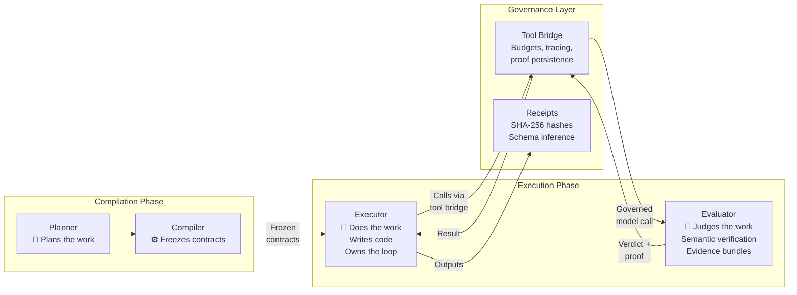

# Compiling Autonomous Work

**Simone Coelho**
Founder, Amadalis
April 2026


If you are expecting this to be another post about how AI agents are going to change everything, you can stop here. There are thousands of those. This is not one of them.

This is a technical note about a specific architectural problem I could not solve with any existing approach, and what I ended up building instead. It covers real failure modes, real engineering decisions, and real execution artifacts from a running system. There is no demo to sign up for. There is no waitlist pitch at the end.

If you have actually tried to make autonomous AI systems work reliably at scale — not demo-scale, not single-shot tasks, but real multi-step work over hundreds of steps — then what follows might be the first thing you have read that matches what you have actually experienced.

---

## What is proven in the public artifacts

Before the philosophy, the evidence. The following claims are testable and inspectable in the [proof artifacts on GitHub](https://github.com/amadalis-ai/forge-architecture):

- **A 9-step compiled workflow reconciled 753 billing entries** against contracts and rate cards — with fail-closed unbound inputs, immutable output bindings, cross-validation before reporting, and a correction simulation with business rule enforcement. ([Run 002 — Billing Audit](https://github.com/amadalis-ai/forge-architecture/tree/main/assets/runs/002-billing-audit))

- **Every compiled step carries a SHA-256 contract hash, declared input/output artifact refs, repair policy, validator rules, and allowed tool IDs.** The plan cannot execute unless all bindings resolve. ([Plan artifact](https://github.com/amadalis-ai/forge-architecture/tree/main/assets/runs/002-billing-audit/plan))

- **The compiler generates a harness around the executor's code** — workspace preparation, input materialization, preflight receipts, postflight receipts, output verification, and persistence — all independent of the model's self-report. ([Compiled steps](https://github.com/amadalis-ai/forge-architecture/tree/main/assets/runs/002-billing-audit/compiled-steps))

- **When a step fails, the system retries under the same immutable contract with a fresh container.** The contract does not change. Only the implementation changes. ([Attempt records](https://github.com/amadalis-ai/forge-architecture/tree/main/assets/runs/001-jsonplaceholder-analysis/compiled-steps))

- **Execution profiles freeze per-phase model selection, validation manifests, skill policy, and budgets into an immutable snapshot** before the first AI call. Governance cannot drift mid-execution. ([Execution profiles](https://github.com/amadalis-ai/forge-architecture/blob/main/docs/execution-profiles.md))

- **A compilation brief documents the compiler's reasoning** — which domain packs were selected, how contracts were wired, what routing decisions were made, and what governance was applied. ([Compilation brief](https://github.com/amadalis-ai/forge-architecture/blob/main/assets/runs/002-billing-audit/compiled-steps/compilation-brief.md))

The rest of this note explains how I got here and why the architecture looks the way it does.

---

## What I kept seeing

When ChatGPT first came out, I immediately started imagining what we could do with this. Automating enterprise workflows. Long-horizon execution. Multi-step processes with real APIs, real data, real deliverables. The potential was obvious to anyone who had spent decades building systems architecture.

So I started experimenting. I tried to make autonomous runs reliable — long executions, multi-step plans, real enterprise work. And even as the models got smarter, I kept hitting the same wall. The failures were not getting better with better models. They were structural. The infrastructure around the models was wrong.

About eighteen months ago, I set out to solve this problem for real. It was driving me crazy. I could see what needed to exist, and it did not exist anywhere. So I started building it — nights and weekends, alongside my day job.

And through all of that building, I kept reading announcements — companies claiming they have replaced entire teams with agents, founders describing near-perfect success rates on complex autonomous work, technical posts that make reliability sound like a solved problem.

I have not found public evidence that other systems jointly demonstrate compilation-style planning, typed handoffs, frozen policy, governed code execution, and receipt-backed verification in one runtime. Pieces exist. The combination — enforced simultaneously, in one machine-verifiable execution model — I have not seen.

Either I am missing something, or the gap between what is claimed and what is publicly inspectable is wide. I say this not to be dismissive. Some teams have genuinely pushed the boundary. But if the reliability problem were actually solved, I would not have spent eighteen months building what I built.

### What the failures actually look like

These are not abstract categories. These are things I watched happen repeatedly:

A model sends a payload to an API. The payload is wrong — a field name is incorrect. You correct it. The model sends the payload again with a different field wrong. You correct that. It tries a third time and gets the nesting structure wrong. Tokens burn. The model's intent was correct every time. It knew exactly what it wanted to do. But the OpenAPI schema was deeply nested, some child objects were JSON, others were serialized text, and two different API surfaces on the same platform called the same entity different things — for example, `customer_id` in one endpoint, `user_id` in another. Same platform. Same semantics. Different words.

A 300-step plan dies on step 47. Not because the model made a bad decision. Because a downstream step expected an artifact that an upstream step was supposed to produce, and nobody checked whether the output shape matched the input contract before execution started.

Long-running sessions where step 20 carries the accumulated fog of steps 1 through 19 — every retry, every dead end, every intermediate tool output — and the model's reasoning gets measurably less precise because it is drowning in its own history.

Every engineer who has actually tried to build these systems at scale knows this feeling. The model is not the problem. The architecture is.

---

## The first discovery: the model needs a different language

The company I work at has some of the most complex API endpoints I have ever seen. Deeply nested objects. Mixed serialization — some children are JSON, some are raw text that needs to be serialized or deserialized differently. Different platform surfaces use entirely different terminology for the same concepts.

So I did the obvious thing. I gave the model the OpenAPI specifications. Full JSON schemas. Property descriptions. Accepted values. Constraints. Validation rules. Everything the model should need to construct a correct payload.

It failed anyway.

Not occasionally. Reliably. On complex nested objects, the model would lose track. The accepted values were described in one place, the property constraints in another, the format requirements in a third location within the same schema document. The model had to hold all of those references in attention simultaneously while constructing the payload, and it could not. Its intent was always correct. The information was always there. But the format of the information overwhelmed it.

This was my first real insight, and it has nothing to do with prompt engineering.

### The menu taker

I realized two things at once.

First: the model needs information to be self-describing at the point of use. Not "see the documentation for accepted values." Not "refer to the constraint definition in section 4.2." Every property must carry its own accepted values, its own constraints, its own format — right where the model reads it. Instead of a schema that says `status: string` with a reference to an enum definition elsewhere, the model sees `status: {ENUM: active|paused|archived}`. Everything inline. Nothing to look up.

Second — and this is the piece that changed everything — the model should never have to construct an API call at all.

I built a serializer engine. It takes any valid JSON schema — an OpenAPI spec, a Swagger file, whatever the customer has — and translates it into a self-describing template. The template is the menu. The model is the customer placing an order.

The model fills in the template. It picks from the enumerations. It provides the values it wants to send. Then the filled template goes back through the serializer, and out the other side comes the correct API payload — properly nested, properly serialized, right field names, right structure.

The model never touches the raw API. It never worries about nesting depth, serialization formats, or schema structure. It says what it wants. The infrastructure translates.

```
OpenAPI / JSON Schema
       |
  [ Serializer ]
       |
  Self-describing template (the menu)
       |
  Model fills the template (places an order)
       |
  [ Serializer ]
       |
  Valid API payload
```

### What the template language actually looks like

This extends far beyond API calls. The same protocol drives the planner itself. Here is a fragment of the template that the planning model receives — this is what it fills in to produce a compiled step:

```json
{
  "label": "{imperative verb phrase}",
  "objective": "{MUST/SHOULD/MAY objective template string}",
  "expected_outputs": [{
    "path": "{Class A user-deliverable path with recognized extension}",
    "role": "{artifact role}"
  }],
  "success_criteria": "{machine-checkable outcome}",
  "abstract_inputs": [{
    "slot": "{FILL|string}",
    "required": "{FILL|boolean}",
    "entity_schema_id": "{FILL|string}",
    "accepted_kind_keys": ["{OPTIONAL|string}"],
    "provenance_policy": "{OPTIONAL_ENUM|none|preferred|required}"
  }],
  "abstract_outputs": [{
    "slot": "{FILL|string}",
    "entity_schema_id": "{FILL|string}",
    "preferred_kind_keys": ["{OPTIONAL|string}"]
  }],
  "artifact_contracts": {
    "{expected_outputs[].path}": {
      "format": "{ENUM|json|csv|parquet|html|md|txt|pdf|yaml|tsv|other}",
      "required_top_level_type": "{OPTIONAL_ENUM|array|object|table}"
    }
  }
}
```

Look at the pattern. Every field tells the model exactly what to put there. `{FILL|string}` means "you provide a string." `{ENUM|json|csv|parquet|html|md}` means "pick one of these." `{OPTIONAL_ENUM|none|preferred|required}` means "pick one, or skip it." The model never has to guess what a field accepts. It never has to look elsewhere to find the constraints. The menu is self-contained.

This was the game changer. In the published runs linked in this note, the template protocol preserved structural fidelity across compiled step generation and downstream contract emission — plans spanning a hundred steps with a thousand sub-steps. The model was never the bottleneck for generation. The way we were talking to it was.

Everyone in the industry describes the inversion abstractly: "let the AI focus on intent, not mechanics." I built the actual mechanism. A bidirectional translator between any JSON schema and a model-consumable template language. Menu in, order out, payload delivered.

---

## The second discovery: correctness needs structure

Solving the generation problem exposed a new one.

The model could now produce the right shape. It could fill complex templates with perfect structural fidelity. But who checks that the values are correct? That the `customer_id` field maps to what the downstream API actually expects? That business rules are enforced — rate limits, required fields, conditional constraints? That the semantic drift between two platforms' vocabulary is handled before it causes a silent failure three steps downstream?

You cannot ask the model to be careful. Careful is not a system property. Careful is a hope.

### The validation ladder

I built a validation pipeline — not instructions to the model, but a multi-stage system that mechanically and semantically checks every output before it moves forward:

- **Structural parsing**: Is this valid JSON? Does it match the expected shape?
- **Synonym resolution**: Does `customer_id` here mean `user_id` there? Map them.
- **Default injection**: Are missing optional fields populated with safe defaults?
- **Business rules**: Does this rate exceed the contract cap? Is this date in the valid range?
- **Schema contracts**: Does this object satisfy the full type contract?
- **Domain validation**: Does this make sense in the context of this specific business domain?

Each stage catches a different class of error. Each error is caught before it reaches the next step — not discovered at runtime when money and time have already been spent.

### From validation to semantic mapping

Then something clicked. If the validation layer understands that `customer_id` and `user_id` are semantically the same entity, that is not just error correction. That is a translation layer.

I can take two entirely different platform schemas — say Shopify and Stripe — and map between them through the ladder. The same system that catches field name mismatches also bridges semantic gaps between different APIs. The validation pipeline became a semantic translation layer, and the translation layer became the foundation for cross-platform interoperability.

Each layer I built exposed the next problem. Each solution revealed the next gap. I was not following a theory. I was following the failures.

---

## The third discovery: the system needs a type system for work

The validation ladder could catch errors. The semantic layer could map fields between platforms. But as I started building longer plans — plans with 10, 20, 50 steps — a deeper problem emerged.

When a user says "audit the billing," what does that actually mean to the system? What data types are involved? Time entries? Rate cards? Invoice line items? What is the workflow — are we comparing two sources, or scoring one? What vocabulary applies? What are the disambiguation boundaries — is this a billing audit or a financial analysis or a security audit?

Without answers, the planner is guessing. And a planner that guesses is an interpreter.

### Domain packs

I built domain packs. A domain pack is a standard library for a business domain. It tells the system everything it needs to know about a class of work:

```json
{
  "domain_pack_id": "billing-audit",
  "purpose": "Reconcile time, rates, contracts, or invoice lines.
    Determine what should be billed, what was billed incorrectly,
    or where billing discrepancies exist.",
  "entity_schemas": [
    "billing.time_entry",
    "billing.rate_card",
    "billing.invoice_line_item",
    "billing.discrepancy_row",
    "billing.billing_summary"
  ],
  "triggers": [
    "billing audit", "invoice discrepancies",
    "timesheet reconciliation", "billable hours"
  ],
  "disambiguation": [
    "Use billing-audit when matching time, rates, contracts,
      or invoice lines. Use finance-analysis when the mission
      is about ledger entries, budgeting, or financial performance.",
    "If the user mentions 'audit' in a controls/compliance context,
      use security-audit instead."
  ]
}
```

That object is not documentation. It is the system's type library for billing work. When the planner sees "audit these timesheets against the rate cards," it does not guess. It loads the billing-audit pack and knows the entity types, the vocabulary, and the disambiguation rules that separate this from finance-analysis or security-audit.

### Workflow packs

Domain packs say what the data is. Workflow packs say how the work flows.

```json
{
  "workflow_pack_id": "reconcile-compare",
  "purpose": "Compare two or more compatible inputs to identify
    matches, mismatches, discrepancies, or missing records.",
  "typical_slots": {
    "inputs": ["normalized_rows", "joined_rows"],
    "outputs": ["findings", "scores", "report_artifact"]
  },
  "triggers": [
    "compare two sources", "find discrepancies",
    "reconcile datasets", "cross-reference and flag mismatches"
  ],
  "disambiguation": [
    "reconcile-compare requires two or more input sources.
      analyze-score-rank operates on one source.",
    "reconcile-compare emits discrepancy findings.
      normalize-transform emits reshaped data without
      comparison semantics."
  ]
}
```

The disambiguation rules are the critical part. The system knows that "reconcile" is not the same as "normalize." It knows "compare" requires two or more inputs. It knows the difference between scoring one source and comparing two. These are the type distinctions that prevent a plan from wiring incompatible steps together.

Today there are 12 domain packs, 12 workflow packs, 24 artifact kinds, 15 cross-step slots, and 5 policy profiles. This is not a type system in the classic programming language sense — it is closer to a semantic contract catalog with typed handoff discipline. But it serves the same function: it gives the compilation pipeline the vocabulary it needs to validate compatibility before execution. It is early — 12 domains, not 200. And like any type system, it gets more useful as it grows.

---

## The thesis

By this point, I had built:

- A language the model can consume with high structural fidelity (imprinting templates)
- A bidirectional serializer that translates between any JSON schema and that language
- A validation ladder that catches errors before they propagate
- A semantic layer that maps between different platform vocabularies
- A type system for business domains and workflows

I started noticing what I had actually been building.

A language for expressing intent. A system that validates output against formal contracts. A semantic layer that resolves meaning across representations. A typed contract discipline. A pipeline that checks everything before execution starts.

I had been building something that looked a lot like a compiler.

I should be precise about what I mean by that. I am not claiming I built GCC for AI. I use "compiler" in the broader systems sense: a pipeline that transforms a high-level human objective into a lower-level executable representation, performs resolution and compatibility checks before runtime, freezes the resulting specification, and executes it under a governed runtime. It is not a traditional native-code compiler. It is a compiler-shaped system for autonomous work. The value of the analogy is not the binary — it is the shift from runtime improvisation to pre-execution structure.

### The interpreter pattern

Most agent systems today work like interpreters. The model receives a task. It decides what to do. It reaches for a tool. It observes what happened. It decides again. The architecture is open-loop and runtime-heavy.

Every compiler engineer knows that shape. The problem is discovered late. Contracts are implicit. Resolution happens on the fly. Failures are paid for at execution time.

### The compiler pattern

What I built does what compilers do:

- **Parse structure**: decompose the objective into steps, dependencies, and success criteria — before any tool is called
- **Resolve symbols**: discover capabilities against a real universe of skills and tools — if it does not exist, it cannot appear in the plan
- **Type-check contracts**: validate input and output declarations between steps — if step 3 expects an artifact that step 2 does not produce, catch it now
- **Emit an executable**: freeze the plan into immutable step contracts with deterministic IDs, manifests, and SHA-256 hashes
- **Execute in isolation**: each step runs in a governed environment with only its contracted inputs and allowed capabilities
- **Verify output**: receipts, checksums, schema inference, and independent review — the model does not mark its own homework

### Fresh mind per step

This is the most important architectural consequence.

Interpreter-style systems drag the same model through the entire run. By step 20, the model is carrying every retry, every dead end, every intermediate output from the previous 19 steps. It is drowning in its own cognitive debt.

In this system, each step begins clean. It receives its compiled contract, its verified inputs, and its allowed capabilities. It does not receive the history of the run. It does not know what happened before it. It does not carry forward any accumulated noise.

Step 300 is as sharp as step 1 — because for the executor, it is step 1.

This does not mean the executor is limited to a single action within its step. A step can contain an entire iterative workflow — the executor can loop over a dataset, process each item individually, write intermediate files, and call governed platform tools per item. The fresh-mind principle means the executor is not polluted by other steps' history, but within its own step it can do substantial, multi-item work.

### The model thinks in code

Most agent platforms work by giving the model a set of pre-built tools and letting it pick which ones to call. The model becomes a dispatcher — it selects from a fixed menu of functions that someone else wrote.

That is not what happens here.

In this system, the model writes code. Not tool calls. Not function selections. Actual programs. When a step needs to compute billing discrepancies, the model does not call a `compute_discrepancies()` tool. It writes a Python script that opens the data files, joins the records, applies the comparison logic, computes the discrepancies, and writes the result. The script runs in a sandbox. The computation produces the answer.

This is the difference between an AI that tells you things and an AI that does things and proves what it did.

If a model tells me "the average value is 47,000," I have to trust that statement. It could be hallucinated. It could be a plausible-sounding number the model confabulated from pattern matching. I have no way to verify it without independently re-running the work.

If the model writes ten lines of code that reads the dataset, sums the values, divides by the count, and prints the result — and that code runs and produces 47,000 — then the answer is tied to computation, not to prediction. The code is inspectable. The execution is logged. The result is verifiable. Prose can sound right while being wrong. Code either runs or it does not.

The executor is not limited to pure computation. When a step requires semantic judgment — evaluating whether an extracted resume profile is faithful to the source document, or whether a contract clause deviates from the standard template — the executor's code calls a governed evaluator through the platform's tool bridge. That evaluator is a separate AI model that receives a bounded evidence bundle and performs the judgment: is the extraction accurate? Is the scoring grounded? Are there hallucinations? The platform handles each model call under governance — enforcing budgets, recording provenance, persisting proof per call. The executor's code orchestrates the workflow loop; the platform governs every AI evaluation within it. For 1,000 resumes, that means the executor loops over candidates, assembles a per-candidate evidence bundle (source text, extracted profile, rubric), and calls the evaluator model per item — 1,000 bounded AI evaluation calls, not one massive prompt.

But here is the critical relationship: letting a model write arbitrary code without structure is dangerous. Without contracts, there is no guarantee that the code produces what the next step expects. Without isolation, the code can access things it should not. Without verification, a script that runs successfully but produces garbage will cascade that garbage downstream.

The compiler is what makes Code-Act safe. The contract defines what the code must produce. The sandbox governs what it can access. The postflight receipt verifies what it actually produced. The model is free to invent whatever solution it wants — any algorithm, any approach, any library — as long as the output satisfies the contract. Maximum creativity within structural governance.

That is the relationship between the compilation pipeline and the executor. The pipeline provides the constraints and contracts. The model provides the intelligence and adaptation. The code provides the inspectable evidence.



---

## What I can show today

I care a lot about separating theory from evidence. Here is a real compiled run.

### The anatomy

A 4-step plan: fetch API data, assemble a relationship graph, compute user metrics, render a ranking page in HTML. Each plan step was decomposed into 8 to 14 compiled sub-steps. The model writes the business logic — one sub-step. The other 7 to 9 are compiler-generated harness: workspace preparation, input materialization, preflight validation, the actual work, postflight validation, output verification, and persistence.

The compiled step contract:

```json
{
  "contract_hash": "sha256:e2ddab22...1490dd4c0b",
  "allowed_tool_ids": ["sandbox.session"],
  "execution_backend": "sandbox.session",
  "routing_reason": "governed_routing_mode:sandbox_first",
  "repair_policy": {
    "strategy": "retry_same_contract",
    "max_retries": 6,
    "immutable_output_bindings": true
  }
}
```

The contract hash seals the entire specification. The repair policy is part of the contract — not an afterthought bolted on at runtime.

### Artifact wiring

Step 0 declares what it will produce. Step 1 declares what it needs to consume. The compiler resolves these before any code runs.

```json
// Step 0 declares its output:
"output_artifact_refs": [{
  "path": "output/_slots/ps-0-fetch-api-datasets/raw_api_data.json",
  "ref_id": "ps-0-fetch-api-datasets:output:3:raw-api-data"
}]

// Step 1 declares it as an input:
"input_artifact_refs": [{
  "path": "output/_slots/ps-0-fetch-api-datasets/raw_api_data.json",
  "ref_id": "ps-1-assemble-relationship-graph:input:0:raw-api-data"
}]

// Step 3 consumes three upstream outputs:
"input_artifact_refs": [
  { "ref_id": "ps-3:input:0:enriched-users" },
  { "ref_id": "ps-3:input:1:raw-api-data" },
  { "ref_id": "ps-3:input:2:related-data-graph" }
]
```

This is not a prompt chain. It is a build graph. The artifacts have stable addresses. The wiring is resolved before step 1 executes. If step 0 does not produce what step 1 expects, step 1 never starts.

### The receipts

After each step, the system independently verifies the model's output:

```json
{
  "step_id": "ps-0-fetch-api-datasets",
  "outputs": [{
    "exists": true,
    "size_bytes": 117067,
    "sha256": "5ce4986d121f06dc418bcb6565640c54...",
    "parse_validation": { "ok": true },
    "schema_summary": {
      "top_level_keys": ["source","users","users_by_id","collections"],
      "row_count_hint": 10,
      "candidate_key_hints": [{
        "columns": ["id"],
        "distinct_count": 10,
        "observed_unique_in_sample": true
      }]
    }
  }]
}
```

The system hashes the output. It validates that it parses. It infers the schema — column names, row counts, candidate keys. This schema summary flows downstream to the next step, so the next model has type information about its inputs without anyone having to declare it manually.

The model does not get to say "I did it." The system checks.

### What happens when something breaks

Two real failures from this same run:

**Infrastructure failure.** The sandbox returned HTTP 500. The system tried a fresh handle on the same container — also failed. So it provisioned an entirely new container and replayed the identical compiled code. The model never knew. The business logic was unchanged. Only the infrastructure was replaced.

**Logic failure.** The model's own validation caught an extra field (`rank`) that the contract did not specify. The system retried under the same immutable contract. The second model invocation generated different code that passed its own checks. The contract did not change. Only the implementation changed.

This is the compiler-runtime separation in practice. The contract is the specification. The model is the implementation. If the implementation fails, you re-compile fresh code under the same specification. You do not debug the failure — you replace the implementation.

---

## Execution profiles: different models for different jobs

Step 0 downloads data from an API. That does not need a frontier reasoning model — it needs a fast, cheap model that can write a fetch script. Step 3 renders a styled HTML report — that wants a creative model. Step 2 does quantitative analysis — that wants strong analytical reasoning. The planner itself should think deeply. The intent resolver and skill resolver can be cheap and fast.

The system does not leave these decisions to chance. Every run is governed by an execution profile — a configuration envelope that controls which model is called at every phase of the pipeline, what prompt it receives, what reasoning strategy it uses, what validation rules apply, and what budgets are enforced. Here is what the planner phase bindings look like in a real profile:

```json
{
  "planner_phase_bindings": {
    "pass_a": {
      "model_binding_ref": "anthropic:claude-opus-4-6",
      "runtime_overrides": {
        "temperature": 0.7,
        "use_extended_thinking": true,
        "thinking_budget_tokens": 4096
      }
    },
    "pass_b": {
      "model_binding_ref": "anthropic:claude-sonnet-4-6",
      "runtime_overrides": { "temperature": 0.3 }
    },
    "pass_c": {
      "model_binding_ref": "anthropic:claude-sonnet-4-6",
      "runtime_overrides": { "temperature": 0.2 }
    }
  },
  "executor_by_backend": {
    "sandbox.session": {
      "model_binding_ref": "anthropic:claude-opus-4-6",
      "runtime_overrides": {
        "use_extended_thinking": true,
        "thinking_budget_tokens": 4096
      }
    },
    "edge_isolate": {
      "model_binding_ref": "anthropic:claude-sonnet-4-6",
      "runtime_overrides": { "temperature": 0.0 }
    }
  }
}
```

Pass A — the initial plan — uses a frontier model with extended thinking. Pass B and C — intent and skill resolution — use a faster, cheaper model. The sandbox executor gets the frontier model. Edge-isolate steps get deterministic settings.

I think about this the way I used to think about configuring a Borland C++ Builder project. Per-compilation-unit settings. Optimization level, target architecture, debug symbols — different for different parts of the build. Not because you want complexity, but because different parts of the work have different requirements.

The profile also controls validation strictness (block, report, or skip at each pipeline phase), skill policy (which skills are required, preferred, or denied), budgets (max steps, timeouts, tool-call limits), and reasoning parameters (extended thinking budgets, reasoning effort levels, provider-specific settings that are automatically filtered by provider).

The entire profile is frozen into an immutable snapshot before the run starts. What governed step 1 is exactly what governs step 50. Governance cannot drift mid-execution. And this extends to workspace-level configuration — a legal workspace can use a different profile than a data analysis workspace. Different planner prompts, different model mixes, different governance rules, different skill bindings. Everything lives within a workspace.

---

## Inside the sandbox: what actually executes

I have described the compiler. But what does the compiler produce? What actually runs?

The compiler generates a dispatch package — a complete executable specification for each plan step. That dispatch package is sent to a sandbox where an executor model decomposes it into concrete sub-steps and runs them. Let me walk through what that looks like.

### The pipeline inside each step

When the executor receives a compiled step contract, it does not just run the model's code. It runs a structured pipeline:

1. **Prepare workspace** — create the directory structure (`/workspace/input`, `/workspace/work`, `/workspace/output`, `/workspace/meta`)
2. **Materialize inputs** — copy the upstream step's verified outputs into the sandbox filesystem at the paths declared in the contract
3. **Project input paths** — symlink upstream artifacts to the exact read paths the model's code expects
4. **Generate preflight receipt** — hash all inputs, infer schema summaries, write a receipt proving what went in
5. **Verify required inputs** — check that every declared required input actually exists on disk
6. **Execute the business logic** — *this is the only sub-step the model writes* — the actual Python script that does the work
7. **Generate postflight receipt** — hash all outputs, validate they parse correctly, infer schema summaries, write a receipt proving what came out
8. **Verify expected outputs** — check that every declared output file exists and is non-empty
9. **Persist outputs** — save the sandbox outputs to durable workspace storage for downstream consumption

The model writes sub-step 6. The compiler generates the other eight. That harness is what makes the execution governed — the model's creativity is wrapped in infrastructure that validates what went in and verifies what came out.

### What a compiled sub-step looks like

Here is the actual business logic sub-step from the first plan step — the model-generated code that fetches data from an API:

```json
{
  "sequence": 5,
  "label": "Fetch JSONPlaceholder datasets and write raw_api_data",
  "type": "python",
  "code": "import json\nfrom pathlib import Path\nfrom urllib.request import Request, urlopen\n...\nusers = fetch_json('/users')\nfor u in users:\n    uid = u['id']\n    posts = fetch_json(f'/users/{uid}/posts')\n    todos = fetch_json(f'/users/{uid}/todos')\n    albums = fetch_json(f'/users/{uid}/albums')\n    raw['users_by_id'][str(uid)] = {...}\n...\nwith out_path.open('w') as f:\n    json.dump(raw, f, indent=2)\nif not out_path.exists():\n    raise RuntimeError('Primary output missing')",
  "exit_code": 0,
  "duration_ms": 10227,
  "ok": true
}
```

The model wrote a complete Python script that calls 35+ API endpoints, structures the data, writes the result, and self-validates. The output path (`/workspace/output/_slots/ps-0-fetch-api-datasets/raw_api_data.json`) was not chosen by the model — it was injected by the compiler. The model cannot write to a different location. The contract owns the paths.

And after this sub-step finishes, sub-steps 7 through 9 run automatically — the compiler-generated harness hashes the output, verifies it parses as valid JSON, infers the schema, and persists it for the next step. The model did not have to remember to do any of that. The infrastructure handled it.

The example above is the simplest pattern — a data-gathering step where the model writes one script that fetches data and produces one output. But the executor is not limited to this pattern. For analysis and evaluation steps, the model writes code that iterates over a dataset and calls governed platform tools per item. For example, a resume screening step might loop over 1,000 candidates: for each one, the executor extracts source text, assembles an evidence bundle (source resume + extracted profile + scoring rubric), and calls the platform's governed evaluator. That evaluator is a separate AI model — a different model from the executor — that receives the bounded evidence bundle and performs semantic judgment: is the extraction faithful to the source? Is the scoring grounded in evidence? Are there omissions or hallucinations? The platform handles each of these model calls under governance — enforcing budgets, recording provenance, persisting proof per call. The sandbox owns the iteration loop; the platform governs every model call within it.

### The attempt record

Every execution of a step is recorded as an attempt with full forensics:

```json
{
  "attempt_id": "attempt_5130295a-5722-43ea-acf8-088e89009017",
  "attempt_number": 1,
  "status": "committed",
  "started_at": "2026-04-09T05:37:10.681Z",
  "finished_at": "2026-04-09T05:41:51.447Z",
  "duration_ms": 280766,
  "sandbox_id": "sbx:demo:...:1t03v:5dukc2",
  "total_steps": 10,
  "completed_steps": 10,
  "persisted_paths": [
    "output/_slots/ps-0-fetch-api-datasets/raw_api_data.json",
    "meta/mcp-tools/journal.ndjson"
  ]
}
```

Each compiled step typically starts without assuming reuse of a prior step's container, but the sandbox runtime can retain and reuse a warm container within the same step for continuations or repair iterations. The `persisted_paths` are the artifacts that survived into workspace storage — everything else should be treated as ephemeral container state. The runtime also persists an MCP/tool journal (`journal.ndjson`) plus receipts and execution evidence for forensic replay.

---

## Capsules: work that compounds

This is where the compiler story becomes an economics story.

When a plan executes successfully, the result is not just output files. The result is a complete record of the compilation: the step graph, the code the model wrote for each sub-step, the input and output manifests, the skill bindings, the validation results, and the exact contracts that governed the run.

That record can be extracted into a Capsule — a self-contained, reusable execution unit. And Capsules come in two forms.

### Sealed Capsules: fully deterministic

Some work is structurally repetitive. The same process, different data, on a schedule. Convert this week's timesheet exports to canonical billing format. Download the API snapshot and compute the enriched metrics. Transform inbound records into the normalized schema.

For this class of work, the sealed Capsule runs without any model inference at all. The executor runs the compiled programs on the new data. The validator checks the outputs. The results are persisted. No tokens spent on planning. No tokens spent on code generation. No tokens spent on capability discovery.

An operation that cost a full planning run the first time costs almost nothing on every subsequent execution. The intelligence was amortized at compile time. The code was proven. The contracts were validated. Now it just runs.

### Structural Capsules: fresh reasoning within a frozen architecture

Some work requires judgment that depends on content. Analyzing a resume requires code — parsing, field extraction, scoring formula computation — but it also requires the model to reason over the actual substance of the resume, weigh qualifications against criteria, and make decisions that cannot be pre-programmed.

Structural Capsules preserve the compiled step graph — the structure, the contracts, the validation requirements, the model assignments. But the generated code for selected steps is cleared. The model executes fresh within the frozen architecture, reasoning over the new content, writing new code as needed, producing outputs that conform to the same contracts.

Everything that was deterministic stays deterministic. Everything that requires thinking gets fresh thinking. And you did not pay for a new plan.

Both modes are implemented and running. Sealed Capsules for deterministic replay with pre-generated code. Structural Capsules for fresh creative reasoning within a frozen architecture.

### What this actually means

Think about what just happened. A non-technical user — not a developer, not an engineer — described what they wanted in natural language. The system compiled it, executed it, and proved it worked. Then they encapsulate it. Now it runs reliably, repeatably, governed by the same contracts, for a fraction of the cost.

This person just wrote a program. Without knowing how to code. Without configuring a workflow builder. They described an objective, and the compiler produced a reusable program from it.

And the Capsules are designed for headless execution. The entire lifecycle is API-driven. Any system that can make HTTP requests can dispatch a Capsule run — no UI required. A webhook receives an event, extracts the parameters, dispatches a Capsule. Deterministic, governed, auditable automation — triggered by events, executed by proven compiled plans.

---

## The problem nobody talks about

I have spent most of this note on the compiler — how it works, what it produces, why it matters. But there is a larger problem that the compiler exists to solve, and I have not said enough about it.

Building an agent is the easy part. Making it do something useful in a demo is the easy part. The hard part is everything that comes after: governance, security, observability, traceability, auditability, and the organizational reality of deploying autonomous systems in an enterprise.

Think about what a company actually has to do to put an AI agent into production. The security team needs to know: what can this agent access? What networks can it reach? What data can it see? Can it exfiltrate information? The compliance team needs to know: can we audit what it did? Can we prove how it arrived at a conclusion? Can we trace a number in a report back to the source data and the computation that produced it? The legal team needs to know: if this agent summarizes case law or extracts contract clauses, can we verify the citations? Can we trace a summary back to the exact paragraphs that were fed into the model? The IT team needs to know: how do we configure this for different departments? How do we enforce different policies for different workspaces? How do we control costs? How do we monitor what is happening?

Today, the answer to most of these questions is: you build it yourself. You need an entire engineering department just to handle the governance, logging, observability, and policy enforcement around the agent — before the agent does any useful work. And every time someone builds a new agent, the CISO's team has to ask the same questions again. Is the environment correct? Is it following the guidelines? Is it calling the right endpoints? How many policies do we need?

This is the real problem. Not "can the model do the work?" The model can do extraordinary work. The problem is: can you prove it did the work correctly, trace how it got there, govern what it had access to, and repeat it reliably — without rebuilding the infrastructure every time?

### The traceability argument

This is where Code-Act and the compiler together produce something that no prompt-and-tools approach can match.

When the model thinks in code, every step of its reasoning is inspectable. It did not just tell you "the average is 47,000." It wrote a program that opened the data, filtered the rows, computed the sum, divided by the count, and printed 47,000. You can read the code. You can see the data it read. You can re-run the computation. You can trace the number in the final report all the way back through the transformation chain — which script produced it, which inputs that script consumed, which upstream step produced those inputs, and which source files those inputs were extracted from.

Consider a law firm using this to review contracts. The system extracts clauses, identifies obligations, flags non-standard terms, and produces a risk register with citations. Every finding in that register is tied to a specific clause in a specific document. Not "the model said this clause is risky." Instead: here is the extraction code that parsed the document, here are the specific paragraphs it read (with line numbers and character offsets), here is the summarization code that produced the finding, and here is how the citation links back to the source text. If someone challenges the finding, you do not ask the model "are you sure?" You open the code, read the extraction logic, and verify the source.

Consider an accounting firm reconciling 753 time entries against contracts and rate cards. The system produces a discrepancy report. Every number in that report — every rate delta, every overcharge amount, every cap violation — is the output of a Python script that you can read. The script shows exactly which fields were compared, which formula was applied, which entries were flagged, and why. The entire chain from source CSV to final report is a sequence of verified, logged, inspectable computations.

This is not possible with a prompt-and-tools approach. If you give a model a prompt and some tools, it can tell you "I called the analysis tool and it returned these results." But it cannot show you how the tool arrived at those results. It cannot show you the intermediate computations. It cannot trace a number from the report back through the transformations to the source data. The reasoning is opaque. The model says "I did it" and you either trust it or you do not.

With compiled execution, the model's work is code. Code is evidence. Evidence is traceable. And that traceability holds across 400 steps — because every step has its own contract, its own receipts, its own checksums, and its own execution log. The model never loses context because it never carries context. Fresh mind, clean contract, verified inputs, inspectable output. Step 400 is as traceable as step 1.

### What becomes possible

When you combine the compiler, Code-Act, capsules, governance, and traceability, the use cases go far beyond document analysis. The system is not limited to files in and reports out. It is a general-purpose execution architecture for any multi-step autonomous work that needs to be governed, traced, and repeatable.

The key insight is the construction analogy. A compiled plan is a blueprint. Each step is a specialist — the plumber, the electrician, the roofer. The plumber does not need to know what the electrician is doing. The roofer does not need to know how the walls were built. The roofer only needs to know that the walls will be there when it is time to put the roof on — and the compiler guarantees that, because the contracts between steps were verified before execution started.

That is the difference between this system and every platform that tries to have one model do everything in one long session. Here, each step is a specialist with a contract, a fresh mind, and the freedom to solve its part of the problem however it sees fit — as long as the output satisfies the contract. The model adapts. It writes its own tools. It invents whatever approach makes sense. But it operates within structural constraints that guarantee the downstream steps will receive what they need.

**Screening a thousand resumes.** The executor loops over candidates within a single step — extracting source text, assembling a per-candidate evidence bundle (source resume + extracted profile + rubric), and calling the platform's governed evaluator per item. One thousand resumes means one thousand bounded governed evaluator calls, not one massive prompt. Each call produces a proof-backed candidate card. The cards aggregate into batch rankings and a global merge. Every score traces to both the extraction code and the governed evaluator call that assessed it. Encapsulate it. Next hiring cycle, run the same Capsule on new resumes.

**Auditing a year of vendor contracts.** The system extracts clauses, identifies obligations, flags non-standard terms, produces a risk register with citations. Every finding traces back through the extraction code to the exact paragraphs in the source documents — with line numbers. A compliance officer can follow the chain from finding to source without asking the model anything.

**Reconciling billing data every Friday.** Sealed Capsule. No model inference. The transformation code is frozen. Every discrepancy in the output can be traced through the computation chain to the source rows. The finance team does not have to trust the model. They can read the code.

**Large-scale research across hundreds of documents.** The executor iterates over documents within a step, extracting claims and evidence per document through governed evaluator calls. Each evaluator call receives a bounded evidence bundle and produces a proof-backed result. Cross-referencing and synthesis happen from audited per-document cards. Every claim in the final report traces to both the extraction code and the governed evaluator call that assessed it — the specific documents, specific paragraphs, and the evaluator's proof record.

**Building a 500-page website.** The plan compiles the full structure — navigation, pages, components, content, styling. Each page is a step. The step that builds page 47 does not need to know how page 12 was built. It needs to know that the navigation component and the theme assets will be there — and the compiler guarantees they will be, because those are contracted outputs of earlier steps. The model generates the code for each page fresh, adapting to the content, but within the structural constraints of the compiled architecture. You do not lose track at page 200 because no single model is carrying the context of pages 1 through 199.

**Customer onboarding workflows.** Imagine a process that configures an application for a new customer — theming, branding, data loading, permission setup, integration configuration, validation checks. Some of it is repetitive and can be sealed Capsules that run identically for every customer. Some of it requires the model to adapt — querying data mid-workflow, adjusting configuration based on what it finds, rewriting the approach when a step encounters something unexpected. The compiled plan provides the structure. The executor provides the adaptation. The governance provides the guardrails.

**Support ticket triage with human-in-the-loop.** The system can determine mid-execution that a step requires human approval — and the plan was compiled with that gate built in. The model cannot evade it. There is only one gatekeeper, and the gatekeeper is the platform — the operating system that runs the compiled program. If the plan says step 5 requires human review before step 6 can start, then step 6 does not start until a human approves. This is not a prompt instruction the model might ignore. It is a structural gate in the compiled execution graph.

**Repetitive operational processes.** Any process that happens on a schedule — weekly data transformation, monthly compliance checks, quarterly reporting — can be compiled once, proven once, and encapsulated. The sealed Capsule runs deterministically with new data. The organization builds a library of compiled programs that get cheaper to run over time. A non-technical person described what they wanted. The system compiled it. Now it runs.

The point is not the use cases themselves. The point is that the architecture makes each one governed, traceable, and repeatable — whether it is a 4-step data pipeline or a 400-step enterprise process. The model has complete freedom to adapt and invent within each step. But the structure around it guarantees that the contracts are met, the governance is enforced, the human-in-the-loop gates cannot be bypassed, and every computation is traceable from deliverable back to source.

The twelve domain packs that exist today — billing audit, legal review, resume screening, research synthesis, finance analysis, security audit, and others — are a starting library. The system is designed for custom packs. If you need a domain pack for insurance claims processing, customer onboarding, or manufacturing quality control, you build it and register it. Every new pack extends what the compiler can compile correctly.

---

## What lives around the pipeline

The compilation pipeline is the thesis, but a pipeline alone does not make a system. Three components matter equally:

**Skills as linked libraries.** Skills are not prompt snippets. They are versioned packages. Here is the actual directory listing of the HTML report generator skill:

```
html-report-generator/
├── SKILL.md                         # behavioral instructions
├── REFERENCE_BIBLE.md               # technical reference
├── scripts/
│   ├── render_report.py             # rendering pipeline
│   ├── validate_report.py           # output validation
│   └── html_to_pdf.py               # format conversion
├── assets/
│   ├── base.css                     # base styles
│   ├── lib/chart.min.js             # charting library
│   ├── templates/                   # 5 report templates
│   │   ├── standard.html
│   │   ├── executive-brief.html
│   │   ├── dashboard.html
│   │   ├── comparison.html
│   │   └── newsletter.html
│   ├── themes/                      # 5 visual themes
│   │   ├── modern.css
│   │   ├── executive.css
│   │   ├── minimal.css
│   │   ├── compliance.css
│   │   └── technical.css
│   └── theme-manifest.json
└── references/
    ├── content-schema.json          # output schema contract
    └── theme-contract.md            # theme requirements
```

When a step's compilation determines it needs this skill, the entire package is materialized from storage into the sandbox at `/skills/html-report-generator/`. The model calls `render_report.py` as a subprocess with the right inputs. It does not need to know how to build HTML reports from scratch. It calls the rendering pipeline and gets verified output. This is library linking — the skill loads at step initialization and the model uses what was linked, not what it imagines exists.

**A governed workspace and file system.** The model sees a file system during execution. The user sees a durable workspace. They are bridged by a materialization layer with provenance tracking — human-uploaded files and agent-produced files tracked separately, with full lineage from origin to deliverable.

**Governance as walls, not rules.** Network egress is controlled at the sandbox level with domain, subdomain, path, and method granularity — not by asking the model to avoid certain URLs, but by structurally blocking them. Budget enforcement uses projected pre-checks and runtime counters to halt execution at the boundary, not after the money is spent. Tool allowlists are both frozen into the step plan at compile time and re-enforced at runtime dispatch. When the executor calls governed platform tools from within the sandbox — like the evaluator for semantic judgment — each call goes through a governed tool bridge where the platform enforces budgets, records provenance, and persists proof. The sandbox cannot make raw model API calls. These are not rules the model promises to follow. They are walls.

**No frameworks, no SDKs.** The system runs on Cloudflare primitives — Workers, Durable Objects, R2, KV, Queues, Vectorize, Containers, and Neon Postgres via Hyperdrive. There are no AI orchestration frameworks and no third-party workflow engines in the stack. The compilation pipeline, the executor, the validation ladder, the skill materializer, and the governance layer are original code. The only external dependency is the model API itself.

---

## Claims and evidence

Every architectural claim in this note maps to inspectable proof in the [public artifact set](https://github.com/amadalis-ai/forge-architecture):

| Claim | Evidence |
|-------|----------|
| Execution is fail-closed on missing inputs | Compilation brief: unbound inputs block the step |
| Output bindings are immutable after compilation | Compiled step contract: `immutable_output_bindings: true`, repair policy |
| Runtime emits receipts independent of the model's self-report | Compiled steps artifact: preflight and postflight receipt sub-steps |
| Sandbox cannot make raw model API calls | Governed tool bridge: all model calls go through platform governance |
| Each step runs in a fresh execution context | Attempt records: different sandbox_id per step |
| Contract hashes seal the specification before execution | Plan artifact: `contract_hash: "sha256:..."` per step |
| Governed evaluator calls are individually traced and proof-persisted | Tool bridge architecture: model_call_id, bundle_sha256, verdict per call |
| Execution profiles are frozen before the first AI call | Execution profiles documentation: immutable snapshot at run start |
| The system handles infrastructure failure transparently | Attempt records: fresh container retry on sandbox 5xx, model never knew |
| Successful runs can be extracted as replayable capsules | Operator packages API: extraction, versioning, headless strict-replay execution |

---

## What I have not solved

The semantic type system is at the beginning of its evolution. Twelve domain packs. Not two hundred.

The compiler has bugs. I have gone six months without finding one, then discovered another in a corner case I never anticipated. That is the nature of compilers. You are never done.

Model quality variance is real and I do not fully understand it. The same nominal model can feel materially different across providers, configurations, and moments in time. I am not claiming to know why. I am claiming that the architecture must be designed to survive it.

This is not a finished product. It is a running system with real evidence and honest boundaries. The things I have shown in this note are proven. The things I have not shown are not.

---

## What I want this note to do

I want a small number of technical readers to consider four things:

Maybe the dominant agent architecture — interpret, act, observe, decide — has structural limitations that better models alone will not fix.

Maybe model capability is only half the story, and the other half is the infrastructure that wraps around it.

Maybe the way we communicate information to models — the format, the structure, the language — matters as much as how smart the models are.

Maybe autonomous work benefits from the same kind of pre-execution structure, validation, and contract discipline that compilers brought to software engineering.

I am not publishing this to define a new category or to claim I have solved everything. I am publishing it because the architecture addresses real failure modes in a way I have not seen elsewhere, and I want to show the work to people who can evaluate it honestly.

The claim is not that any individual primitive is new — workflow engines, typed DAGs, capability registries, sandboxed execution, and replayable jobs all exist in various forms. The claim is that this runtime enforces these invariants simultaneously, in one machine-verifiable execution model: compilation-style planning, typed handoffs, frozen policy, code-backed execution, governed evaluation, and replayable capsules.

If you have built agent systems and felt the pain of runtime ambiguity, silent contract mismatches, capability hallucination, or context decay, then you understand why I ended up here. And if you come from compilers, enterprise integration, or data infrastructure, the shape of this argument probably feels familiar.

That is the audience I want to reach. Not people looking for a magic demo. People who can evaluate whether applying compiler principles to autonomous work is a meaningful architectural direction.

---

*The [full architecture thesis](/research/architecture), [proof artifacts](https://github.com/amadalis-ai/forge-architecture), and supporting technical documentation are available. This note is the front door. The building is behind it.*

*Simone Coelho is the founder of Amadalis. He has been building systems architecture for over two decades, starting with a Pascal compiler at fifteen and a college thesis on compiler design. He can be reached via the [contact page](/contact).*
